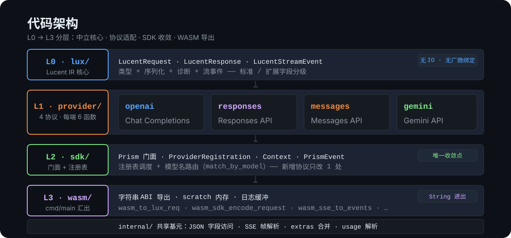

<div align="center">
  
</div>

---

## 快速示例

三行代码，调用任意 LLM 厂商：

```moonbit nocheck
///|
let prism = Prism::new().with_provider("openai")

///|
let req_json = prism.encode_request("你好", PrismOptions::default())
// → {"model":"gpt-4o","input":[{"type":"message","role":"user","content":[...]}]}

///|
let reply = prism.decode_response(resp_json) // Ok("你好！有什么可以帮你的？")
```

切换厂商只需改 provider 名：

```moonbit nocheck
///|
let prism = Prism::new().with_provider("anthropic") // 自动适配 Claude 格式
// → {"model":"claude-sonnet-4","messages":[...]}
```

**完整请求-响应流程（L1 零配置）：**

```moonbit nocheck
let prism = Prism::new().with_provider("openai-chat")

// send 是 Host 注入的 HTTP 回调
let result = prism.complete("你好", PrismOptions::default(), send)
// result = Ok("你好！有什么可以帮你的？")
```

---

## 架构设计

> **从概念到代码**：四层递进，每个包只有单一职责。

### 概念：为何需要中间协议？

传统 N 个厂商 × N 个格式 = N² 适配的工作量。Prism 通过一层中立协议（**Lucent IR**）解耦，新增厂商只需 1 次双向适配：

```
Provider A  ──┐
Provider B  ──┤── Lucent IR ──→ 任意目标协议
Provider C  ──┘                (O(N) 替代 O(N²))
```

### 协议层：6-Function 适配器契约

每个 Provider 适配器实现 **6 个纯函数**，String 进出：

| 方向 | 解码（外部 → Lucent IR） | 编码（Lucent IR → 外部） |
|------|------------------------|------------------------|
| **请求** | `ext_to_lux_request(String) → Result[LucentRequest, String]` | `lux_request_to_ext(LucentRequest) → Result[String, String]` |
| **响应** | `ext_to_lux_response(String) → Result[LucentResponse, String]` | `lux_response_to_ext(LucentResponse) → Result[String, String]` |
| **流式** | `ext_sse_to_events(String) → Result[Array[LucentStreamEvent], String]` | `lux_events_to_ext_sse(Array[LucentStreamEvent]) → Result[String, String]` |

当前已实现 **9 个适配器**：

| 适配器 | 协议 | 状态 |
|--------|------|------|
| `provider/openai_chat` | OpenAI Chat Completions | ✅ |
| `provider/openai_responses` | OpenAI Responses API | ✅ |
| `provider/openai_codex` | OpenAI Codex 变体 | ✅ |
| `provider/openai_azure` | Azure OpenAI | ✅ |
| `provider/openai_vllm` | vLLM | ✅ |
| `provider/anthropic` | Anthropic Messages API | ✅ |
| `provider/gemini` | Google Gemini API | ✅ |
| `provider/gemini_vertex` | Google Vertex AI | ✅ |
| `provider/gemini_interactions` | Gemini Interactions | ✅ |

### 代码层：四层包结构

<div align="center">
  
</div>

| 层级 | 包路径 | 职责 | 依赖 |
|------|--------|------|------|
| **L0** | `lux/` | Lucent IR 核心类型 + JSON 序列化 | 仅 `core/json` |
| **L1** | `provider/*/` | 厂商双向编解码适配器 | 仅 `lux/` |
| **L2** | `sdk/` | Provider 注册表 + Prism / Context / Event | 所有 provider |
| **L3** | `wasm/` | 通用 WASM 导出层 | 仅 `sdk/` + `lux/` |

### 运行时：一次 encode_request 的完整路径

```
Prism::encode_request("你好", opts)
  → Context::new().add_user("你好")
    → context_to_lux_request()           # L0: 构建 LucentRequest
      → match_provider_name("openai")    # L2: SDK 注册表调度
        → reg.request_encode(req)         # L1: openai_chat 适配器
          → OpenAI JSON 字符串 → Host 发 HTTP
```

### 数据流全景

```
                    ┌──────────────┐
  Provider JSON ──► │  Lucent IR   │ ──► Provider JSON
  (decode ←)        │  (中立格式)    │     (→ encode)
                    └──────────────┘
                         ↕
                    SDK 注册表调度
                         ↕
                    WASM 通用导出层
```

### 依赖收敛

```
优化前: 根包 + sdk + wasm 各独立 import 7 个 provider  →  3 处修改
优化后: 只需在 sdk/ 注册 1 处 → wasm 和根包零感知
```

---

## 多级 API

### L1：应用开发者——一行调用

```moonbit nocheck
///|
let prism = Prism::new().with_provider("openai")

///|
let req = prism.encode_request("写一首诗", PrismOptions::default())

///|
let reply = prism.decode_response(resp_json)
```

### L2：框架作者——事件循环

```moonbit nocheck
let ctx = Context::new()
  .add_system("你是一个有用的助手")
  .add_user("帮我查北京的天气")
  .add_tools([SdkTool { name: "get_weather", ... }])

match prism.decode_sse(sse_text) {
  Ok(events) => {
    for event in events {
      match event {
        TextDelta(s) => ui.append(s)        // 流式文本
        ToolCall(tc) => execute_tool(tc)    // 工具调用
        Thinking(t) => ui.show_thinking(t)  // 推理过程
        Finish(r) => break                  // 结束
      }
    }
  }
}
```

---

## 项目状态

| 模块 | 状态 |
|------|------|
| Lucent IR 核心类型 (34+ 类型) | ✅ |
| JSON 序列化 / 反序列化 | ✅ |
| 流式事件 + 累加器 | ✅ |
| 9 个 Provider 适配器（各 6 函数） | ✅ |
| 跨协议往返一致性测试 | ✅ |
| SDK 表层 API（Prism / Context / Event） | ✅ |
| WASM 导出层（15 个导出函数，见 scripts/export_count.sh） | ✅ |
| MoonBit 测试 | ✅ **807 passed** |
| 多语言 wrapper（Go/TS/Python） | ✅ 可用（classic wasm ABI） |
| Transport Daemon（HTTP JSON-RPC + SSE 流式） | ✅（Go，wazero backend） |
| Transport Daemon（UDS/NamedPipe/WebSocket + session 流式） | ✅ |
| 客户端 SDK（clients/go、clients/python，传输可插拔） | ✅（HTTP/UDS/WS 一行切换） |
| 质量门禁 | ✅ 警告 506→0（CI `--deny-warn`）、导出数生成式维护（`scripts/export_count.sh`） |
| SDK 验证（T01-T12） | ✅ 全部完成 |
| 运行示例（examples/sdk-basic） | ✅ 可运行 |
| WASM 真实 API 测试 | ✅ 通过 |

当前仓库可验证的是 MoonBit native/wasm-gc 核心（**807 测试全绿、0 警告**），基于 classic `wasm` 目标的 Go/TS/Python wrapper（UTF-16 线性内存 ABI），以及 `transport/daemon` 三传输运行时（HTTP/UDS/WS，Go + wazero）与 `clients/go`、`clients/python` SDK。

**WASM 真实 API 测试结果：**
- 请求转换 (OpenAI Chat → Anthropic/Gemini) ✅
- 响应解码 ✅
- 流式 SSE 解码 ✅
- 协议转换 ✅

**运行示例：**
```bash
# MoonBit SDK 示例
moon run examples/sdk-basic

# TypeScript WASM 示例（真实 API），详见 examples/README.md
cd examples/ts-wasm && bun run src/main.ts
```

---
[README.mbt.md#3D64]
INS.POST 165:
## 开发原则

1. **纯函数** — 无 IO、无状态、无副作用
2. **String 进出** — WASM 导出零摩擦
3. **Round-trip 安全** — Provider → Lux → Provider 语义一致
4. **JSON Schema 事实标准** — `schemas/lux-ir-v1.json`

---

## 运行示例

项目包含两个可运行的示例：

### MoonBit SDK 示例

```bash
moon run examples/sdk-basic
```

展示内容：
- 编码请求 / 解码响应
- SSE 流式解码
- 协议转换 (OpenAI Chat → Anthropic/Gemini)
- 能力查询

### TypeScript WASM 示例（真实 API）

真实 API 演示（安装依赖、环境变量配置、端到端测试等）请参见 [examples/README.md](examples/README.md)。

---

## 开源协议

[MIT License](LICENSE) — 自由商用、二次开发，保留开源声明即可。

