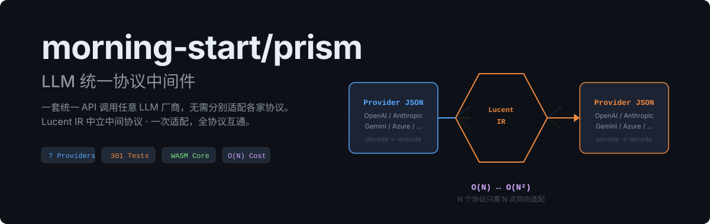

<div align="center">
  
</div>

<h3 align="center">LLM 统一协议中间件</h3>
<p align="center">
  OpenAI · Anthropic · Gemini — 一套 IR，自由转换
</p>

<p align="center">
  <a href="https://www.moonbitlang.com"></a>
  <a href="LICENSE"></a>
  <a href="https://github.com/morning-start/prism/actions"></a>
</p>

---

## What is Prism?

Prism is a **protocol conversion engine** for LLM APIs. It converts between provider-specific JSON and SSE formats through a neutral intermediate representation (**Lucent IR**), enabling any two protocols to interoperate with O(N) adapters instead of O(N²).

```
OpenAI JSON  ──[decode]──►  Lucent IR  ──[encode]──►  Anthropic JSON
Gemini JSON  ◄──[encode]──  Lucent IR  ◄──[decode]──  OpenAI JSON
```

## Quick Start

**MoonBit SDK:**

```moonbit
let prism = Prism::new().with_provider("openai")
let req_json = prism.encode_request("Hello", PrismOptions::default())
let reply = prism.decode_response(resp_json)
```

**Go wrapper:**

```go
p, _ := prism.New(wasmBytes)
reqJSON, _ := p.EncodeRequest("openai", "Hello", nil)
```

**TypeScript wrapper:**

```ts
const client = new PrismClient(wasmBytes)
const reqJSON = client.encodeRequest("openai", "Hello")
```

## Architecture

```
cmd/main (WASM exports)
  └─ wasm (string ABI envelope)
       └─ sdk (facade + registry + pipeline)
            └─ provider adapters (protocol codecs)
                 └─ lux (Lucent IR, diagnostics, stream)
                      └─ internal (JSON + SSE primitives)
```

Each provider adapter implements **6 pure functions**: request/response/stream × decode/encode.

## Providers

| Adapter | Protocol | Status |
|---------|----------|--------|
| `openai` | OpenAI Chat Completions | ✅ |
| `responses` | OpenAI Responses API | ✅ |
| `messages` | Anthropic Messages API | ✅ |
| `gemini` | Google Gemini API | ✅ |

Plus aliases: `chat`, `codex`, `azure`, `vllm`, `claude`, `google`, `vertex`, `interactions`.

## Three Usage Modes

| Mode | Target User | Description |
|------|------------|-------------|
| **MoonBit SDK** | MoonBit developers | Direct `Prism::new()` API |
| **Go wrapper** | Backend engineers | `prism.New(wasmBytes)` |
| **TypeScript wrapper** | Full-stack developers | `new PrismClient(wasmBytes)` |

## Installation

```bash
moon add morning-start/prism
```

## Documentation

- [USAGE.md](USAGE.md) — Full usage guide with 4 scenarios
- [docs/architecture.md](docs/architecture.md) — Architecture decisions
- [docs/lux-ir-design.md](docs/lux-ir-design.md) — Lucent IR specification
- [schemas/lux-ir-v1.json](schemas/lux-ir-v1.json) — JSON Schema

## License

[MIT](LICENSE)
