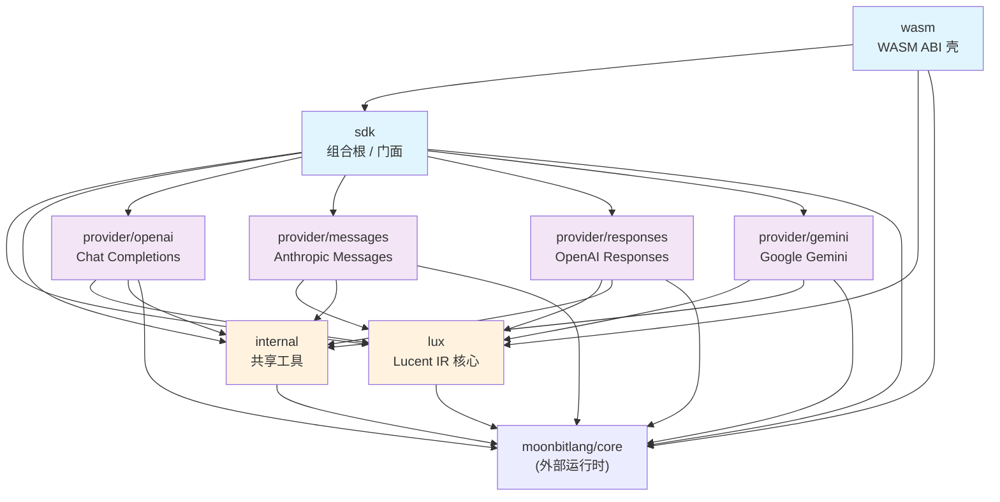
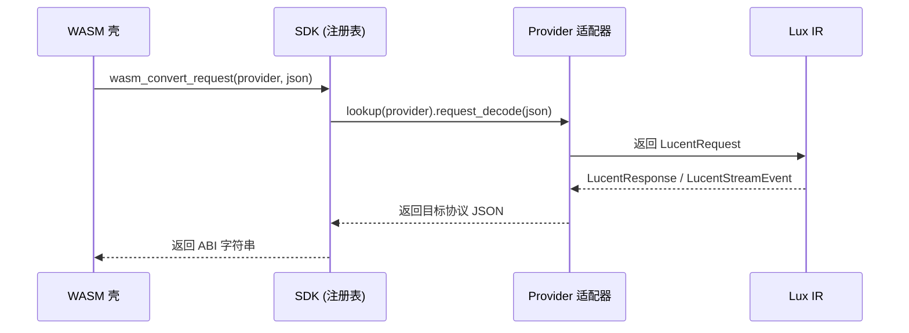

# 包依赖关系

> 每个 MoonBit 目录是一个包（含 `moon.pkg`），依赖方向单向向下。
> 本文件标注所有包的职责、核心导出、依赖关系及 Mermaid 图。

---

## 全局依赖关系图

---

## 各包功能说明

### `src/lux` — Lucent IR 核心

**定位**：所有协议的统一内部表示（Intermediate Representation），是整个系统最底层的非外部依赖包。

| 文件 | 职责 |
|------|------|
| `types.mbt` | 核心类型定义：`LucentRequest` / `LucentResponse` / `LucentStreamEvent` / `LucentContent` / `LucentToolChoice` 等 |
| `stream.mbt` | 流事件枚举与 `BlockAccumulator`（流式内容累积器） |
| `builders.mbt` | 类型构造器：`from_string` / `new()` / `visible()` / `redacted()` 等 |
| `helpers.mbt` | 辅助方法：`LucentReasoningEffort::to_string` 等 |
| `diagnostics_json.mbt` | `ConversionDiagnostic` JSON 编解码 |
| `serialize_*.mbt` | 序列化：Request / Response / Stream / Primitives / Meta |
| `deserialize_*.mbt` | 反序列化：按职责拆分为 8 个文件 |

**依赖**：仅 `moonbitlang/core/json`（外部运行时）。**不依赖任何 provider 或 sdk。**

---

### `src/internal` — 共享工具

**定位**：JSON 字段访问、SSE 帧解析、extras 合并等通用原语，被所有 provider 适配器使用。

| 文件 | 职责 |
|------|------|
| `json.mbt` | `obj_get` / `field_str` / `field_arr` / `field_int` 等 JSON 字段访问函数 |
| `sse.mbt` | `parse_sse_frame` / `parse_sse_frame_with_reason`：SSE 帧解析（带失败原因版本） |
| `extras.mbt` | `collect_extra_fields` / `merge_extras_json` / `extras_without`：扩展字段合并与过滤 |
| `usage.mbt` | `parse_usage_json` / `parse_reasoning_tokens` / `parse_cached_tokens` 等 usage 统计解析 |

**依赖**：仅 `moonbitlang/core/json`。**不依赖 lux，被 lux 之上所有包使用。**

---

### `src/sdk` — 组合根 / 用户门面

**定位**：静态注册表 + 用户侧 API 门面，是所有协议分发的唯一下游。所有对外暴露的 `Prism::*` 方法都在此包。

| 文件 | 职责 |
|------|------|
| `prism.mbt` | `Prism` 结构体：`with_provider` / `encode_request` / `encode_request_with_diagnostics` / `check_capability` |
| `context.mbt` | `Context` / `SdkMessage` / `SdkTool`：用户侧对话构建 API |
| `registry.mbt` | `ProviderRegistration` / `build_providers()`：4 provider 注册表（函数指针表） |
| `match.mbt` | provider 模式匹配：`resolve_provider` / `match_model_pattern` |
| `pipeline.mbt` | `run_pipeline`：request → IR → response 编排流水线 |
| `codec_pipeline.mbt` | 编解码流水线：encode/decode 与 diagnostics 注入 |
| `convert.mbt` | 跨协议转换：request/response/stream 三向 |
| `schema.mbt` | JSON Schema 校验：`validate_request_schema` |
| `event.mbt` | 流事件辅助 |

**依赖**：lux + internal + 四个 provider 包 + core。**是唯一同时知道所有 provider 的包。**

---

### `src/wasm` — WASM ABI 壳

**定位**：WASM 导出函数的薄封装层，仅负责字符串 ABI 信封与错误格式化，不含协议逻辑。

| 文件 | 职责 |
|------|------|
| `convert.mbt` | `wasm_convert_*` / `wasm_sdk_*` / `wasm_to_lux_request` 等 23 个导出函数 |
| `memory.mbt` | `wasm_convert_*_trace` 带 trace 的变体（可选诊断输出） |

**依赖**：lux + sdk + core。**不直接调用任何 provider，全部经 sdk 注册表分发。**

---

### `src/provider/openai` — OpenAI Chat Completions 适配器

**定位**：`/v1/chat/completions` 协议双向编解码。

| 文件 | 职责 |
|------|------|
| `request_decode.mbt` | `openai_to_lux_request`：OpenAI 请求 JSON → LucentRequest |
| `request_encode.mbt` | `lux_request_to_openai`：LucentRequest → OpenAI 请求 JSON |
| `response.mbt` | `openai_to_lux_response` / `lux_response_to_openai`：响应双向 |
| `stream_decode.mbt` | `openai_sse_to_events`：SSE → LucentStreamEvent |
| `stream_encode.mbt` | `lux_events_to_openai_sse`：LucentStreamEvent → SSE |
| `capability.mbt` | `capability()`：声明支持 tool_calling / parallel_tool_calls / reasoning / multimodal |

**依赖**：lux + internal + core。

---

### `src/provider/messages` — Anthropic Messages 适配器

**定位**：`/v1/messages` 协议双向编解码（含 extended thinking 支持）。

| 文件 | 职责 |
|------|------|
| `request_decode.mbt` | `messages_to_lux_request`：Anthropic 请求 JSON → LucentRequest |
| `request_encode.mbt` | `lux_request_to_messages`：LucentRequest → Anthropic 请求 JSON |
| `response.mbt` | `messages_to_lux_response` / `lux_response_to_messages`：响应双向 |
| `stream_decode.mbt` | `messages_sse_to_events`：SSE → LucentStreamEvent |
| `stream_encode.mbt` | `lux_events_to_messages_sse`：LucentStreamEvent → SSE |
| `capability.mbt` | `capability()`：声明支持 tool_calling / reasoning / multimodal |

**依赖**：lux + internal + core。

---

### `src/provider/responses` — OpenAI Responses API 适配器

**定位**：`/v1/responses` 协议双向编解码（含 stateless reasoning continuation）。

| 文件 | 职责 |
|------|------|
| `request_decode.mbt` | `responses_to_lux_request`：Responses 请求 JSON → LucentRequest |
| `request_encode.mbt` | `lux_request_to_responses`：LucentRequest → Responses 请求 JSON |
| `response.mbt` | `responses_to_lux_response` / `responses_json_to_lux_response` / `lux_response_to_responses`：响应双向（含额外 JSON 变体） |
| `stream_decode.mbt` | `responses_sse_to_events`：SSE → LucentStreamEvent |
| `stream_encode.mbt` | `lux_events_to_responses_sse`：LucentStreamEvent → SSE |
| `capability.mbt` | `capability()`：声明支持 tool_calling / reasoning / structured_output |

**依赖**：lux + internal + core。**额外导出** `responses_json_to_lux_response`（第 7 个 pub 函数）。

---

### `src/provider/gemini` — Google Gemini 适配器

**定位**：Google Gemini / Vertex AI 协议双向编解码。

| 文件 | 职责 |
|------|------|
| `request_decode.mbt` | `gemini_to_lux_request`：Gemini 请求 JSON → LucentRequest |
| `request_encode.mbt` | `lux_request_to_gemini`：LucentRequest → Gemini 请求 JSON |
| `response.mbt` | `gemini_to_lux_response` / `lux_response_to_gemini`：响应双向 |
| `stream_decode.mbt` | `gemini_sse_to_events`：SSE → LucentStreamEvent |
| `stream_encode.mbt` | `lux_events_to_gemini_sse`：LucentStreamEvent → SSE |
| `capability.mbt` | `capability()`：声明支持 tool_calling / multimodal / structured_output |

**依赖**：lux + internal + core。

---

## 协议分发流图

---

## 依赖规则

- **单向向下**：`wasm → sdk → provider/* → lux → internal`；反向依赖禁止。
- **不跨层**：`wasm` 不直接调用 `provider/*`，全部经 `sdk` 注册表分发。
- **provider 间隔离**：四个 adapter 互不依赖，各自只依赖 `lux` + `internal`。
- **lux 最底层**：不依赖任何 provider 或 sdk，是唯一无业务依赖的类型包。
- **扩展字段软失败**：未知扩展数据保留在 `extra` / `provider_payload` 中，不可抛错。
