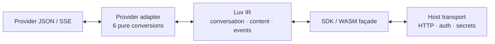
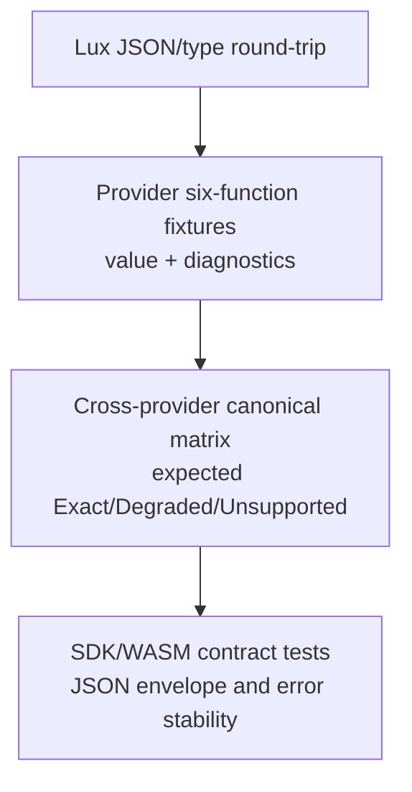

# Prism 架构与代码质量审查

> 审查日期：2026-07-28  
> 范围：`lux/`、`provider/`、`sdk/`、`wasm/`、根级跨协议测试与设计文档。  
> 方法：源码与设计契约交叉审阅；执行 `moon test` 作为可构建性验证。本文不修改运行时代码。

## 执行摘要

**结论：分层方向是对的，但当前不能视为“核心完成”。**

Prism 采用 `Lux IR → Provider adapters → SDK/WASM façade` 的三段式架构。中间层通过异质 `LucentConversationItem` 表达消息、工具调用、工具结果与推理；适配器固定为六个纯转换函数；WASM 保持 String JSON 边界。这是适合协议转换内核的结构：新增协议的实现成本近似 $O(N)$，而不是任意协议两两互转的 $O(N^2)$。

真正的问题不是目录划分，而是**契约没有贯通到执行路径**：

1. 仓库当前无法通过编译，因此所有“测试全部通过”的文档声明已失效。
2. IR 规定转换必须显式区分 `Exact / Degraded / Unsupported / Invalid`，但适配器仍以 `Result[T, String]` 返回，丢失与降级不能被消费者、SDK 或 WASM 表达。
3. 部分适配器把未知或已支持但未实现的语义静默忽略；这直接违背“不静默丢失”的核心不变量。
4. SDK/WASM 仍是薄 façade，文档承诺的 HTTP、密钥注入、Agent 上下文继续、三运行形态一致性并未落地。

建议暂停新增 Provider 和 SDK 表面能力，先完成 **P0 构建恢复 + P1 转换结果模型贯通**。否则每增加一个协议，会将“已丢失的语义不报错”复制到更多路径。

## 已验证的优点

| 设计点 | 证据 | 评价 |
|---|---|---|
| 中立 IR 骨干 | `lux/lux.mbt:104-148, 233-246`；`docs/lux-ir-design.md:30-86` | `LucentConversationItem` 让 Responses 的 item 模型不必被扭曲为纯 messages；工具、推理和 Agent 动作有明确类型归宿。 |
| 适配器职责边界 | `docs/lux-ir-design.md:499-513` | 六函数全部是纯字符串转换；无 HTTP、密钥或重试进入 adapter，适合 WASM 与跨语言调用。 |
| Provider 注册集中 | `sdk/provider_capability.mbt:13-65, 163-203` | SDK 分发收敛在一个 registry。新增基础 provider 不必散布改动到 `Prism`。 |
| 子协议复用策略 | `provider/openai_codex/codex.mbt:4-12, 53-106` | Codex 在 Responses 基础上仅后处理 `phase` 和 `xhigh`，Azure / Vertex 同类包装避免复制完整转换器。 |
| 类型序列化测试基础 | `lux/serialize_wbtest.mbt`、`lux/deserialize_wbtest.mbt` | Lux 的结构体和枚举具有较完整的 round-trip 测试基础，适合作为后续契约测试的底座。 |
| 跨协议测试意图正确 | `cross_protocol_test.mbt:1-10, 50-147` | canonical IR 往返各协议是验证中间表示是否真中立的正确测试方向。 |



该职责切分应保留。改进目标不是引入更多层，而是使每一条箭头都能报告保真度和边界。

## P0：构建已损坏，测试状态不可作为质量依据

### 事实

2026-07-28 运行 `moon test` 失败，包含至少以下编译错误：

- `lux/deserialize_wbtest.mbt:275`：`LucentTool::new` 的第五参数要求 `LucentToolKind`，测试传入 `None`。
- `lux/json_helper.mbt:70`：当前 core JSON 的 `Json::Number` 只有一个位置参数，代码按两个参数匹配。
- `lux/json_helper.mbt:112,124`：`Json::Object` 的只读性与 `Map.delete` API 假设不匹配。

因此 `docs/requirements.md:41-43` 与 `README.mbt.md:217-219` 的“301 tests passed / 全部通过”不能作为当前事实。

### 风险

这是发布阻塞项。适配器、SDK、WASM 都依赖 `lux/json_helper`，任何针对架构缺口的修复都无法得到基本回归反馈。

### 最小修复

1. 先按当前 MoonBit core 的 JSON API 改写 `json_helper`；不要在适配器内各自规避。
2. 修正 `deserialize_wbtest` 中 `LucentToolKind` 构造值。
3. 运行 `moon info && moon fmt && moon test`。
4. 只有通过后才更新测试计数或完成状态；计数应由 CI 生成，不应手工写入多处文档。

## P1：转换结果模型未接入，无法兑现保真度治理

### 事实

- 规范要求每项转换显式是 `Exact`、`Degraded`、`Unsupported` 或 `Invalid`：`docs/rules/lucent-ir-evolution.md:112-121`。
- Lux 定义了 `ConversionStatus`、`ConversionDiagnostic` 和 `ConversionResult[T]`：`lux/lux.mbt:321-357`。
- 但六函数正式契约仍固定为 `Result[T, String]` / `Result[String, String]`：`docs/lux-ir-design.md:499-507`；SDK registry 也保存同样签名：`sdk/provider_capability.mbt:21-32`。
- 全仓仅定义这些类型，无适配器、SDK 或 WASM 消费它们：`ConversionResult` 搜索只命中定义及文档声明。

### 风险

成功的 `Result` 无法表达“返回值可用但一个字段已经降级或丢弃”。这让调用者错误地把语义损失当作准确转换；目前的静默分支正是这个抽象缺口的直接后果。

### 决策

不要立即把所有 WASM 函数改成复杂泛型返回值。保持 String 输入输出，但新增**统一的带诊断转换信封**：

```text
adapter internal: ConversionResult[T] | Invalid(error)
SDK/WASM boundary: { value, diagnostics } | { error, diagnostics }
legacy six functions: only after明确决定兼容期，或在 v2 clean cutover 后移除
```

`Unsupported` 与 `Degraded` 不应自动成为硬失败：它们是宿主的策略选择；`Invalid` 才是无值失败。每个 adapter 的新契约测试必须断言诊断集合，而不仅仅断言 JSON 能解析。

| 维度 | 取舍 |
|---|---|
| 优点 | 保真度从注释变成可检测的协议输出；SDK 与 WASM 能将风险交给调用方策略。 |
| 成本 | 影响六函数、registry、WASM 与测试；属于公共 API 变更。 |
| 前置条件 | P0 构建恢复；先冻结 IR v1 的 wire shape。 |
| 不采用的代价 | 新 Provider 继续用 `()` 隐藏不支持字段，转换结果无法被信任。 |

## P1：适配器存在可验证的静默语义损失

### OpenAI Responses

- `input_image` 与 `input_file` 被忽略：`provider/openai_responses/responses.mbt:36-45`。
- `reasoning` 请求配置解析是空实现：`provider/openai_responses/responses.mbt:148-152`，但编码侧确实输出 reasoning：`391-413`。
- `previous_response_id` 被读取后直接设为 `None`：`218-221`。字段审计将其归属 Transport：`docs/protocols/field-audit.md:74-76`；因此应该从 IR adapter 去除该“半处理”代码，并在 transport 设计中落实，而非伪装已消费。
- SSE 输入解析遇到非法 data 直接跳过：`679-725`。这至少应产生 `Invalid` 诊断，否则截断流会被当作成功流。

### OpenAI Chat、Anthropic、Gemini

- Chat 编码将 `Reasoning` 与 `AgentAction` 直接忽略：`provider/openai_chat/chat.mbt:474-502`。不支持是合理的，但必须显式诊断。
- Anthropic 将 `Image/Audio/Video/Native` 编码为空字符串：`provider/anthropic/anthropic.mbt:416-418`。空字符串会改变消息形状，不等价于“不支持”。
- Gemini 把 `inlineData` / `fileData` 变为文本占位：`provider/gemini/gemini.mbt:78-85`。这属于 `Degraded`，不得伪装为 `Exact`；若 IR 已能表示媒体，优先转换为 `LucentMultimedia`。
- 适配器中大量 `_ => ()` 分支可用于可选字段，但对 content/item/event 分支必须逐项标注：忽略、降级或无效。当前代码搜索可见相关分支横跨 `provider/` 全部基础适配器。

### 最小修复顺序

1. 以内容、会话 item、流事件三类“形状字段”为优先，禁止默默 `()`。
2. 可以精确映射的多媒体先实现 `LucentMultimedia`；不能映射的产生 `Unsupported` 诊断。
3. 为每个 provider 建立同一组 fixture：文本、图片、文件、工具、推理、拒绝、未知内容、畸形 SSE。
4. 测试断言值**和**诊断；未知新字段不得因解析器默认分支而消失。

## P1：流式累加器没有保留全部标准事件语义

`lux/stream.mbt` 将流事件合成为 `LucentResponse`。它正确处理文本、工具和推理块，但仍有三处信息损失：

- `AgentAction` 在 `ItemStart` 时被丢弃：`300-313`。
- `NativeDelta` 不累加：`327-343`。
- `Annotations` 不写入响应：`345-355`；虽然提供了单独的 `lucent_collect_annotations`：`382-397`，但默认主路径会遗漏引用。

### 风险

调用方只使用标准 accumulator 时，会悄然失去 citation / URL 等标注，或 Agent 动作。独立 helper 不构成默认正确性，因为调用者必须知道并手工补调。

### 最小修复

定义 accumulator 的明确产物类型，例如：

```text
AccumulatedResponse {
  response: LucentResponse
  annotations: Array[LucentAnnotation]
  native_events: Array[LucentStreamEvent]
  diagnostics: Array[ConversionDiagnostic]
}
```

若 v1 `LucentResponse` 不能承载 AgentAction，则把它保留在该产物或诊断里；不能继续直接丢弃。保留当前 `lucent_stream_events_to_response` 仅在有明确兼容策略时，否则 clean cutover。

## P2：SDK 的公开承诺与实现职责不一致

### 事实

- `Prism` 保存 `api_key` 与 `base_url`：`sdk/prism.mbt:45-72`，但请求编码只按 provider 调用 registry：`80-93, 122-131`。这些字段没有任何消费路径。
- `PrismOptions.store` 与 `extras` 被放入 IR：`sdk/context.mbt:95-107`，但适配器实现/字段审计尚未普遍读写它们；项目自身也曾记录此缺口：`docs/rules/audit-gaps.md:27-40`。
- `Context` 只有 system/user/assistant 的字符串消息与工具定义：`sdk/context.mbt:8-61`；无法注入结构化 `ToolResult`、多模态内容、推理或执行完工具后的真实会话项。
- `decode_sse` 处理 `ToolArgumentsDelta` 为 no-op，`ThinkingDelta` 却被映射成 `TextDelta`：`sdk/prism.mbt:181-231`。这与 SDK 文档中“Thinking 事件”的语义不一致。
- `sdk/` 和 `wasm/` 没有匹配 `^test ` 的测试；公共 façade 缺少契约测试。

### 决策

将 SDK 定位收窄为“纯编解码 façade”，或补齐它声称拥有的 Agent/transport 职责。当前实现同时暴露 `api_key` / `base_url`，又要求 Host 自行发 HTTP（`docs/sdk-usage.md:31-39, 201-208`），两种模型混在一个类型内。

推荐前者，因其符合 WASM 无网络安全边界：

- 从 `Prism` 移除未消费的 `api_key` 和 `base_url`，或把它们移到尚未实现的 `TransportConfig`，该配置不能出现于纯转换 API。
- 扩展 Context 之前先确定 SDK 层是否真提供 Agent loop；若提供，必须有 `add_tool_result` 与结构化 content 的公共 API；若不提供，不要用 L2 Agent API 的文档承诺。
- 事件降级应携带诊断，不可把 thinking 文本伪装为 text delta。

| 维度 | 保持纯 façade | 扩展为完整 SDK |
|---|---|---|
| 与 WASM 边界 | 完全一致 | 需要注入 transport trait / host callback |
| 实现成本 | 低；删除死字段并补编码测试 | 高；需要工具执行、会话持久化、失败与流控制 |
| 推荐 | **当前阶段采用** | 只有明确产品需求和端到端测试后采用 |

## P2：测试策略验证“能往返”，未验证“不能静默丢失”

`cross_protocol_test.mbt` 是正确起点，但部分断言显式放宽语义：

- Chat 的 `tool_choice` 不保留且不做一致性断言：`50-68`。
- Anthropic 仅断言 conversation 长度不小于原值：`72-94`。
- Gemini 因 tool result 格式不同直接改用简化输入：`117-147`。

这些不是测试失败；它们是尚未被诊断模型接住的兼容差异。应把每个放宽点转换为明确 `Degraded` 或 `Unsupported` 预期，再验证其诊断字段和宿主策略。

建议测试金字塔：



## P3：重复工具代码与文档漂移增加维护成本

### 重复

- `lux/json_helper.mbt:81-104` 提供 JSON escape；WASM 又维护 `json_escape_sdk`：`wasm/wasm.mbt:489-511`。
- 多个 adapter 手写 SSE 前缀扫描；例如 Responses 逐字符识别 `event: ` / `data: `：`provider/openai_responses/responses.mbt:679-713`。

应在 Lux 增加纯、通用的 JSON escape 与 SSE record parser；adapter 仅维护供应商事件名到 `LucentStreamEvent` 的映射。不要建立大而全的 provider 基类，MoonBit 的纯函数组合比继承层级更合适。

### 文档漂移

- README 描述 HTTP gateway、IPC 与 WASM 三种已存在形态：`README.mbt.md:55-61, 111-143`；当前目录只有 WASM，Transport / HTTP 仍列为规划项：`README.mbt.md:221-225`。
- README 声称 42 个 WASM 导出：`README.mbt.md:217`；WASM 头部仍写 24 个 / 4 adapter：`wasm/wasm.mbt:2-5`；需求文档写 42：`docs/requirements.md:40`。实际代码涵盖 7 个 provider 的六函数及 SDK helper，需由生成式清单统一维护。
- `docs/requirements.md:12-18` 仍把多数 adapter / WASM 标为待实现，却在 `32-43` 标为已完成。这是同一文档内部冲突。

文档是 public contract 的一部分。建议把“已实现”限制为通过 CI 验证的功能；未来功能放入 roadmap，避免同一 README 同时称为“当前能力”和“规划能力”。

## 推荐路线图

| 阶段 | 目标 | 完成门槛 |
|---|---|---|
| 0. 构建恢复 | 修复 `json_helper` 与测试构造器 API 漂移 | `moon info && moon fmt && moon test` 成功；更新或删除失效测试计数。 |
| 1. 保真度契约 | 将 `ConversionResult` 接入 adapter、registry、WASM JSON 信封 | 每个形状字段的 `Exact/Degraded/Unsupported/Invalid` 都有可观察测试。 |
| 2. 基础 adapter 修复 | 处理媒体、reasoning、SSE 解析错误与 AgentAction / annotation 汇聚 | canonical fixture matrix 覆盖四个基础协议；不再允许形状字段的裸 `_ => ()`。 |
| 3. SDK 定位 | 选择纯 façade 或完整 agent runtime；移除未实现承诺 | 公共 API、文档与 WASM exports 一致；SDK/WASM 具备独立测试。 |
| 4. 维护性 | 抽取 JSON/SSE 纯 helper，统一生成 API / 测试清单 | 新 adapter 只新增映射逻辑与 fixtures，不复制解析基础设施。 |

## 当前评分

| 维度 | 评分 | 依据 |
|---|---:|---|
| 业务对齐 | 6/10 | 核心“协议转换内核”已具备正确形状，但 README 承诺的 gateway/IPC/transport 未实现。 |
| 可维护性 | 6/10 | 分包和子协议复用合理；大量手写 JSON/SSE 与静默分支会放大维护成本。 |
| 可扩展性 | 5/10 | 六函数与 IR 骨干可扩展；没有诊断贯通时每个新 provider 都会复制不可见的降级。 |
| 正确性 / 保真度 | 4/10 | 设计规则明确，但实现没有结果通道，且存在已验证的内容/事件静默丢失。 |
| 测试可信度 | 2/10 | 当前 `moon test` 编译失败；cross-provider 测试尚未断言降级边界。 |
| 安全边界 | 7/10 | Adapter/WASM 维持纯函数、无网络；SDK 中未消费的 api_key/base_url 造成职责混淆，但未见实际外泄路径。 |

## 非建议项

- **不要**现在引入 HTTP server、重试、熔断或复杂 plugin 架构。它们建立在一个尚不能报告转换保真度的内核上，会扩大问题面。
- **不要**因重复函数立刻构建抽象 adapter 基类。先抽 JSON/SSE 的无厂商纯 helper；内容映射的差异是真实复杂度，不应被继承层遮住。
- **不要**以“测试通过”掩盖约束放宽。不能保真的转换必须将边界作为结果的一部分返回。

## 审查结论

Prism 的最佳资产是“以中立会话事件流为骨干”的 IR 选择，以及 adapter / transport 的干净边界。当前首要工作是把该边界的**信息损失变成可观察的输出**，并恢复构建可信度。完成 P0 与 P1 后，继续增加 Provider 才是低风险的线性扩展；此前继续堆叠功能只会加深行为与文档不一致。
