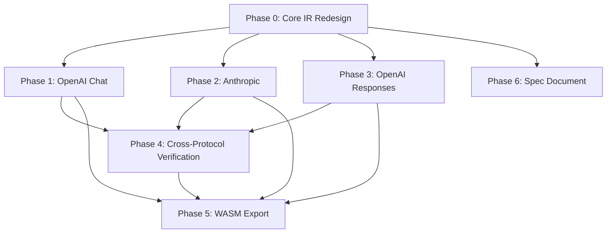

# Prism Intermediate Protocol Implementation Plan

> **For agentic workers:** REQUIRED SUB-SKILL: Use superpowers:subagent-driven-development (recommended) or superpowers:executing-plans to implement this plan task-by-task. Steps use checkbox (`- [ ]`) syntax.

**Goal:** Ship Prism v1 — a vendor-neutral LLM protocol intermediate representation with 3 protocol adapters (OpenAI Chat, Anthropic Messages, OpenAI Responses), block-lifecycle streaming, WASM export, and cross-protocol consistency verification.

**Architecture:** Dual-layer protocol conversion. Prism IR is a canonical conversation model with `ContentPart` tree, `ConversationItem`-level structure, and block-lifecycle `StreamEvent`. All adapters are pure functions: external JSON in → Prism IR out / Prism IR in → external JSON out. No IO, no state, no network inside protocol packages.

**Tech Stack:** MoonBit wasm-gc, moonbitlang/x/json (v0.4.47), moonbitlang/core

## Global Constraints

- Package name: `morning-start/prism`, target `wasm-gc`, license Apache-2.0
- All adapters are pure functions: `String -> Result[IR, String]`
- No IO, no state, no network inside protocol/ packages
- MoonBit block-style code organization (`///|` separators)
- Run `moon info && moon fmt` before each commit
- Run `moon test` to verify, `moon test --update` for snapshot updates
- Prefer assertion tests for stable results, snapshot tests for debug output
- JSON snake_case for wire format, MoonBit follows language convention
- `schema_version: "v1"`, `capabilities` + `extra` for extension
- All stream events carry same `request_id`, `sequence` monotonic, `done` terminal
- No API keys, endpoints, auth in protocol — host config only
- `content` is always `ContentPart[]`, never string union
- `LucentContent.ToolResult` content is `Array[LucentContent]` (not string)
- Tool parameters: `arguments_json` (raw JSON string) + `arguments_value` (parsed object, optional)
- Reasoning is a first-class content type with opaque signature, not plain text
- Cross-protocol consistency: same conversation → all adapters produce semantically identical IR
- **Naming:** `protocol/lux/` package path, `@lux` import alias, `Lucent*` type prefix (e.g. `@lux.LucentRequest`, `@lux.LucentStreamEvent`)


---

## File Structure

```
prism/
│   ├── lux/
│   │   ├── moon.pkg                 # @lux package
│   │   ├── lux.mbt                  # Lucent core types — redesigned
│   │   ├── stream.mbt               # LucentStreamEvent — NEW
│   │   └── lux_wbtest.mbt           # Updated tests
│   ├── openai_chat/
│   │   ├── moon.pkg                 # (unchanged)
│   │   ├── chat.mbt                 # OpenAI Chat adapter — rebuilt
│   │   └── chat_wbtest.mbt          # Expanded tests
│   ├── anthropic/
│   │   ├── moon.pkg                 # NEW
│   │   ├── messages.mbt             # Anthropic Messages adapter — NEW
│   │   └── messages_wbtest.mbt      # NEW
│   └── openai_responses/
│       ├── moon.pkg                 # NEW
│       ├── responses.mbt            # OpenAI Responses adapter — NEW
│       └── responses_wbtest.mbt     # NEW
├── wasm/
│   ├── moon.pkg                     # (updated deps)
│   └── wasm.mbt                     # WASM export layer — NEW
├── cmd/main/
│   ├── moon.pkg                     # (unchanged)
│   └── main.mbt                     # (unchanged, demo placeholder)
└── docs/
    └── superpowers/
        └── specs/
            └── 2026-07-24-prism-intermediate-protocol-spec.md  # Formal spec — NEW
```

---

## Phase 0: Core IR Redesign

**Goal:** Redesign `protocol/mid` types to match OMP research findings. Breaking changes to `LucentContent`, `LucentRequest`, `LucentResponse`. Add stream event model. All existing tests must be updated and pass.

**Dependencies:** None. This is the foundation every other phase depends on.

**Files:**
- Modify: `protocol/lux/lux.mbt`
- Modify: `protocol/lux/lux_wbtest.mbt`
- Create: `protocol/lux/stream.mbt`

### Interfaces

**Consumes:** Nothing (foundation phase)

**Produces:**
- `LucentRole` — enum (System, User, Assistant, Tool)
- `LucentContent` — enum with Text, ToolUse, ToolResult, Thinking, Refusal, Image (stub), Audio (stub)
- `LucentMessage` — struct with role + content: Array[LucentContent]
- `LucentTool` — struct with name + description + parameters_json
- `LucentRequest` — struct with model + instructions + messages + tools + options + capabilities + metadata + extra
- `LucentResponse` — struct with id + model + choices + usage + provider_payload
- `LucentUsage` — struct with prompt_tokens + completion_tokens + total_tokens
- `LucentStreamEvent` — enum for block-lifecycle streaming
- `LucentToolCall` — struct for stream event payloads (id + name + arguments_json)
- `LucentFinishReason` — enum (Stop, Length, ToolCalls, ContentFilter, Error)

### Changes from Current Types

| Current | New | Rationale |
|---------|-----|-----------|
| `LucentContent.ToolResult(String, String)` | `LucentContent.ToolResult(String, Array[LucentContent])` | Anthropic returns multiple blocks in tool results |
| `LucentContent` only Text/ToolUse/ToolResult | Add `Thinking(String, String?)`, `Refusal(String)`, `Image(String, String)` (stub), `Audio` (stub) | Reasoning, refusal, multimodal from OMP research |
| `LucentRequest` flat fields | Add `instructions: Array[LucentContent]?`, `options: LucentOptions`, `capabilities: LucentCapabilities?`, `metadata: Map[String, String]?`, `extra: Map[String, Json]?` | System/developer separate, extension points |
| `LucentResponse` simple | Add `provider_payload: Json?`, `finish_reason: LucentFinishReason` per choice | Provider-native data preservation |
| `LucentDelta`, `LucentStreamChoice`, `LucentStreamChunk`, `LucentToolCall` (old) | Remove. Replace with `LucentStreamEvent` enum | Block-lifecycle model, not OpenAI delta |
| `finish_reason: String` | `LucentFinishReason` enum | Type safety, consistency |

- [ ] **Step 1: Redesign `LucentContent` enum**

```moonbit
/// LucentContent — a content part within a message
pub enum LucentContent {
  Text(String)
  ToolUse(String, String, String, Json?) // id, name, arguments_json, arguments_value?
  ToolResult(String, Array[LucentContent])  // tool_call_id, content parts
  Thinking(String, String?)              // text, signature?
  Refusal(String)                        // refusal text
  Image(String, String)                  // (stub) media_type, data
  Audio(String, String)                  // (stub) media_type, data
} derive(Eq, Debug)
```

- [ ] **Step 2: Redesign `LucentRequest`**

```moonbit
/// LucentOptions — generation parameters
pub struct LucentOptions {
  temperature : Double?
  top_p : Double?
  max_output_tokens : Int?
  stop : Array[String]?
  stream : Bool
} derive(Eq, Debug)

/// LucentCapabilities — capability declaration
pub struct LucentCapabilities {
  tool_calling : Bool
  parallel_tool_calls : Bool
  reasoning : Bool
  multimodal_input : Bool
  structured_output : Bool
} derive(Eq, Debug)

/// LucentRequest — a complete LLM request
pub struct LucentRequest {
  model : String
  instructions : Array[LucentContent]?
  messages : Array[LucentMessage]
  tools : Array[LucentTool]?
  tool_choice : String?
  options : LucentOptions
  capabilities : LucentCapabilities?
  metadata : Map[String, String]?
  extra : Map[String, Json]?
} derive(Eq, Debug)
```

- [ ] **Step 3: Redesign `LucentResponse`**

```moonbit
/// LucentFinishReason — typed finish reason
pub enum LucentFinishReason {
  Stop
  Length
  ToolCalls
  ContentFilter
  Error
} derive(Eq, Debug)

/// LucentChoice — one candidate response
pub struct LucentChoice {
  message : LucentMessage
  finish_reason : LucentFinishReason
} derive(Eq, Debug)

/// LucentResponse — a non-streaming LLM response
pub struct LucentResponse {
  id : String
  model : String
  choices : Array[LucentChoice]
  usage : LucentUsage?
  provider_payload : Json?
} derive(Eq, Debug)
```

- [ ] **Step 4: Create `stream.mbt` with `LucentStreamEvent`**

```moonbit
/// LucentStreamEvent — one atomic event in a normalized stream
pub enum LucentStreamEvent {
  /// Start of a content block at content_index
  ContentStart(Int, String)            // index, type ("text" | "tool_call" | "thinking")
  /// Text delta for a content block at content_index
  ContentDelta(Int, String)            // index, delta
  /// End of a content block at content_index
  ContentEnd(Int)                      // index
  /// Tool call metadata (id + name) at content_index, sent once at start
  ToolCallMeta(Int, String, String)    // index, id, name
  /// Message role metadata
  Role(String)                         // "assistant"
  /// Finish reason
  Finish(String?)                      // "stop" | "length" | "tool_calls" | null
  /// Token usage
  Usage(LucentUsage)
  /// Error
  Error(String)
  /// Stream complete
  Done
} derive(Eq, Debug)

/// Accumulate a stream of LucentStreamEvent into a LucentResponse
pub fn lucent_stream_events_to_response(
  events : Array[LucentStreamEvent],
  id : String,
  model : String,
) -> LucentResponse
```

- [ ] **Step 5: Update constructors and helpers**

```moonbit
pub fn LucentContent::thinking(text : String, signature : String?) -> LucentContent
pub fn LucentContent::refusal(text : String) -> LucentContent
pub fn LucentContent::tool_result(id : String, content : Array[LucentContent]) -> LucentContent
pub fn LucentOptions::default() -> LucentOptions  // stream=false, rest=None
pub fn LucentRequest::new(...) -> LucentRequest    // updated signature
pub fn LucentResponse::new(...) -> LucentResponse  // updated signature
```

- [ ] **Step 6: Update `lux_wbtest.mbt`**

Update all 13 existing tests for new type signatures. Add tests for:
- Thinking content construction
- Refusal content construction
- ToolResult with multiple content blocks
- Stream event accumulation into response
- LucentOptions defaults
- LucentFinishReason enum values

- [ ] **Step 7: Verify**

```bash
moon info                 # Check interface file
moon test                 # All tests pass
```

- [ ] **Step 8: Commit**

```bash
git add -A
git commit -m "feat(protocol): redesign core IR types with stream events, reasoning, multimodal stubs"
```

---

## Phase 1: Rebuild OpenAI Chat Adapter

**Goal:** Rebuild `protocol/openai_chat` against the new IR types. Complete request/response parsing with tool calls, tool results, streaming, multi-content. This is the primary integration test for the new IR.

**Dependencies:** Phase 0 must be complete (new Lucent types exist and tests pass).

**Files:**
- Modify: `protocol/openai_chat/chat.mbt`
- Modify: `protocol/openai_chat/chat_wbtest.mbt`

### 6-Function Contract (Every Adapter)

Each protocol adapter MUST implement exactly 6 public functions:

| # | Direction | Decode (external → Lucent) | Encode (Lucent → external) |
|---|-----------|------------------------|-------------------------|
| 1 | Request   | `ext_to_lucent_request(String) → Result[LucentRequest, String]` | `lucent_request_to_ext(LucentRequest) → Result[String, String]` |
| 2 | Response  | `ext_to_lucent_response(String) → Result[LucentResponse, String]` | `lucent_response_to_ext(LucentResponse) → Result[String, String]` |
| 3 | Stream    | `ext_sse_to_events(String) → Result[Array[LucentStreamEvent], String]` | `lucent_events_to_ext_sse(Array[LucentStreamEvent], String, String) → Result[String, String]` |

**Rationale:**
- Request encode/decode: cover the full request path (your app → Lucent → provider, and provider → Lucent → your app)
- Response encode/decode: cover the full response path
- Stream encode/decode: cover the streaming path
- Pure functions, no IO, no state — string in, string out (or typed result)
- All 6 functions are needed for a complete dual-layer protocol conversion

**Current `openai_chat` coverage gap:**

| Function | Status | Notes |
|----------|--------|-------|
| `openai_chat_to_lucent_request` | ✅ exists | request decode (external → Lucent) |
| `lucent_request_to_openai_chat` | ❌ missing | request encode (Lucent → external) |
| `openai_chat_to_lucent_response` | ❌ missing | response decode (external → Lucent) |
| `lucent_response_to_openai_chat` | ⚠️ exists but incomplete | response encode — no tool_calls, no finish_reason enum |
| `openai_chat_sse_to_events` | ❌ missing | stream decode (SSE → LucentStreamEvent[]) |
| `lucent_events_to_openai_chat_sse` | ❌ missing | stream encode (LucentStreamEvent[] → SSE) |

### Interfaces

**Consumes:**
- `LucentRequest`, `LucentResponse`, `LucentContent`, `LucentRole`, `LucentTool`, `LucentOptions`, `LucentFinishReason`, `LucentUsage`, `LucentStreamEvent`, `LucentToolCall` from `protocol/mid`

**Produces:**
- `openai_chat_to_lucent_request(String) -> Result[LucentRequest, String]` — request decode
- `lucent_request_to_openai_chat(LucentRequest) -> Result[String, String]` — request encode
- `openai_chat_to_lucent_response(String) -> Result[LucentResponse, String]` — response decode
- `lucent_response_to_openai_chat(LucentResponse) -> Result[String, String]` — response encode
- `openai_chat_sse_to_events(String) -> Result[Array[LucentStreamEvent], String]` — stream decode
- `lucent_events_to_openai_chat_sse(Array[LucentStreamEvent], String, String) -> Result[String, String]` — stream encode
### Mapping Rules

**OpenAI Request → LucentRequest:**

| OpenAI | LucentRequest | Notes |
|--------|-----------|-------|
| `model` | `.model` | direct |
| `messages[?role=system].content` | `.instructions` | system/developer → instructions |
| `messages[].content` (string) | `.messages[].content[Text]` | single string |
| `messages[].content` (array) | `.messages[].content[Text/Image]` | content parts, skip image_url for now |
| `messages[].tool_calls` | `.messages[].content[ToolUse]` | each tool_call → ToolUse |
| `messages[?role=tool].tool_call_id` | `.messages[].content[ToolResult]` | tool result, content from messages[].content |
| `temperature` | `.options.temperature` | |
| `max_tokens` / `max_completion_tokens` | `.options.max_output_tokens` | prefer max_completion_tokens |
| `stream` | `.options.stream` | |
| `tools[].function` | `.tools[]` | extract name, description, parameters |
| `tool_choice` | `.tool_choice` | |

**LucentResponse → OpenAI Response:**

| LucentResponse | OpenAI | Notes |
|-------------|--------|-------|
| `.id` | `id` | |
| `.model` | `model` | |
| — | `object: "chat.completion"` | hardcoded |
| `.choices[].message.role` | `choices[].message.role` | |
| `.choices[].message.content[]` | `choices[].message.content` | Text parts → string, ToolUse → .tool_calls |
| `.choices[].finish_reason` | `choices[].finish_reason` | Stop→stop, Length→length, ToolCalls→tool_calls |
| `.usage` | `usage` | |
| `.provider_payload` | ignored | internal only |

**LucentStreamEvent → OpenAI SSE:**

| LucentStreamEvent | OpenAI SSE delta | Notes |
|----------------|-----------------|-------|
| Role("assistant") | `delta.role: "assistant"` | first event |
| ContentStart(0, "text") | implicit | no-op in OpenAI format |
| ContentDelta(0, "Hello") | `delta.content: "Hello"` | |
| ContentEnd(0) | implicit | check for tool call start |
| ToolCallMeta(1, "id", "name") | `delta.tool_calls[0].id/function.name` | |
| ContentDelta(1, "{\"city\") | `delta.tool_calls[0].function.arguments` | |
| Finish("stop") | `delta.finish_reason: "stop"` | |
| Usage(u) | `usage: {...}` | final chunk |
| Done | SSE: `data: [DONE]` | |

### Task Steps

- [ ] **Step 1: Implement request decode → LucentRequest**

`openai_chat_to_lucent_request`:
- Instructions extraction from system/developer messages → `.instructions`
- Multi-content block parsing: `content` string → `[Text]`, `content` array → content blocks
- Tool call parsing: `tool_calls[]` → `ToolUse` content
- Tool result parsing: `tool_call_id` + `content` → `ToolResult` with `Array[LucentContent]`
- Tool definition parsing: `tools[].function` → `LucentTool`
- Options mapping: `temperature`, `max_tokens`/`max_completion_tokens`, `stream` → `LucentOptions`

- [ ] **Step 2: Implement request encode LucentRequest → OpenAI Chat JSON**

`lucent_request_to_openai_chat`:
- `.instructions` → system messages prepended (or `developer` role)
- `.messages[]` → OpenAI `messages[]`:
  - LucentContent::Text → `content` string or `{type: "text", text}`
  - LucentContent::ToolUse → `tool_calls[]` on assistant message
  - LucentContent::ToolResult → `{role: "tool", tool_call_id, content}`
  - LucentContent::Thinking → convert to text or omit (OpenAI has no native thinking)
  - LucentContent::Refusal → `{role: "assistant", refusal: "text"}`
- LucentTool → `{type: "function", function: {name, description, parameters: parse(parameters_json)}}`
- LucentOptions → `temperature`, `max_tokens`, `stream`

- [ ] **Step 3: Implement response decode → LucentResponse**

`openai_chat_to_lucent_response`:
- Parse `id`, `model`
- Parse `choices[]` → `LucentChoice[]`:
  - `message.content` → `LucentContent::Text` (or content blocks)
  - `message.tool_calls` → `LucentContent::ToolUse` per tool_call
  - `message.refusal` → `LucentContent::Refusal`
  - `finish_reason` → `LucentFinishReason` (stop→Stop, length→Length, tool_calls→ToolCalls, content_filter→ContentFilter)
- Parse `usage` → `LucentUsage`
- Wrap in `LucentResponse`

- [ ] **Step 4: Implement response encode LucentResponse → OpenAI Chat JSON**

`lucent_response_to_openai_chat` (rebuild from scratch):
- LucentResponse.id → `id`
- LucentResponse.model → `model`
- Hardcoded: `object: "chat.completion"`
- LucentResponse.choices[0].message.content[] → OpenAI message:
  - Text parts → concatenated to `content` string
  - ToolUse → `tool_calls[]` with `{id, type: "function", function: {name, arguments: arguments_json}}`
  - Thinking → skip or concat as text
  - Refusal → `refusal` field
- LucentFinishReason → `finish_reason` string
- LucentUsage → `usage` object
- Note: current implementation is too simple — rebuild to handle tool_calls, refusal, content blocks

- [ ] **Step 5: Implement stream decode SSE → LucentStreamEvent[]**

`openai_chat_sse_to_events`:
- Parse each SSE line: `data: {...}` or `data: [DONE]`
- Map `choices[0].delta` to LucentStreamEvent lifecycle:
  - `delta.role: "assistant"` → `Role("assistant")`
  - `delta.content` → `ContentDelta` (need to track content_index)
  - `delta.tool_calls[0].id` → `ToolCallMeta`
  - `delta.tool_calls[0].function.name` → `ToolCallMeta` (if not already sent)
  - `delta.tool_calls[0].function.arguments` → `ContentDelta`
  - `delta.finish_reason` → `Finish(reason)`
  - `usage` → `Usage(usage)`
  - `data: [DONE]` → `Done`
- Handle content block boundaries: when tool_calls appear, close previous text block

- [ ] **Step 6: Implement stream encode LucentStreamEvent[] → OpenAI SSE**

`lucent_events_to_openai_chat_sse`:
- Group LucentStreamEvent[] into OpenAI SSE chunks:
  - `Role("assistant")` → `data: {"choices":[{"delta":{"role":"assistant"}}]}\n\n`
  - `ContentDelta(index, text)` → `data: {"choices":[{"delta":{"content":"text"}}]}\n\n`
  - `ToolCallMeta(index, id, name)` → `data: {"choices":[{"delta":{"tool_calls":[{"id":"id","function":{"name":"name"}}]}}]}\n\n`
  - `ContentDelta(index, args)` when tool_call active → `data: {"choices":[{"delta":{"tool_calls":[{"function":{"arguments":"args"}}]}}]}\n\n`
  - `Finish(reason)` → `data: {"choices":[{"delta":{},"finish_reason":"reason"}]}\n\n`
  - `Usage(usage)` → `data: {"usage":{...}}\n\n`
  - `Done` → `data: [DONE]\n\n`

- [ ] **Step 7: Write comprehensive tests**

Minimum 12 test cases (covering all 6 functions):
1. Request decode: simple user message
2. Request decode: system + user + tools
3. Request encode: LucentRequest → OpenAI JSON
4. Response decode: text + tool_calls + usage
5. Response encode: LucentResponse → OpenAI JSON (with tool_calls)
6. Response encode: LucentResponse → OpenAI JSON (refusal)
7. Streaming: text chunk → LucentStreamEvent
8. Streaming: tool call chunk sequence → LucentStreamEvent[]
9. Streaming: LucentStreamEvent → SSE text
10. Streaming: full sequence (text + tool_calls + usage + done)
11. Error handling on invalid JSON
12. Empty messages array

- [ ] **Step 8: Verify**

```bash
moon info
moon test
```

- [ ] **Step 9: Commit**

```bash
git add -A
git commit -m "feat(openai_chat): rebuild adapter with all 6 conversion functions, streaming, tool_calls"
```

---

## Phase 2: Anthropic Messages Adapter
**Goal:** Implement `protocol/anthropic/messages.mbt` — full Anthropic Messages API ↔ Prism IR conversion with streaming, tool calling, thinking blocks.

**Dependencies:** Phase 0 (core IR) must be complete.

**Files:**
- Create: `protocol/anthropic/moon.pkg`
- Create: `protocol/anthropic/messages.mbt`
- Create: `protocol/anthropic/messages_wbtest.mbt`

### Interfaces

**Consumes:**
- All Lucent types from `protocol/lux`

**Produces:** (6-function contract)

| # | Function | Direction |
|---|----------|-----------|
| 1 | `anthropic_to_lucent_request(String) → Result[LucentRequest, String]` | request decode |
| 2 | `lucent_request_to_anthropic(LucentRequest) → Result[String, String]` | request encode |
| 3 | `anthropic_to_lucent_response(String) → Result[LucentResponse, String]` | response decode |
| 4 | `lucent_response_to_anthropic(LucentResponse) → Result[String, String]` | response encode |
| 5 | `anthropic_sse_to_events(String) → Result[Array[LucentStreamEvent], String]` | stream decode |
| 6 | `lucent_events_to_anthropic_sse(Array[LucentStreamEvent], String, String) → Result[String, String]` | stream encode |

### Mapping Rules

**Anthropic Request → LucentRequest:**

| Anthropic | LucentRequest | Notes |
|-----------|-----------|-------|
| `model` | `.model` | |
| `system` (top-level) | `.instructions` | single or array of text blocks |
| `messages[].role` | `.messages[].role` | "user"→User, "assistant"→Assistant |
| `messages[].content[?type=text].text` | `.messages[].content[Text]` | |
| `messages[].content[?type=image]` | `.messages[].content[Image]` | (stub for v1) |
| `messages[].content[?type=tool_use]` | `.messages[].content[ToolUse]` | id, name, input → arguments_json |
| `messages[].content[?type=tool_result]` | `.messages[].content[ToolResult]` | tool_use_id, content parts |
| `messages[].content[?type=thinking]` | `.messages[].content[Thinking]` | text + signature |
| `messages[].content[?type=redacted_thinking]` | `.messages[].content[Thinking]` | text="[redacted]", signature |
| `max_tokens` | `.options.max_output_tokens` | required field |
| `temperature` | `.options.temperature` | |
| `tools[].input_schema` | `.tools[].parameters_json` | Anthropic uses `input_schema` |
| `stop_sequences` | `.options.stop` | |
| `stream: true` | `.options.stream` | |

**Anthropic Response → LucentResponse:**

| Anthropic | LucentResponse | Notes |
|-----------|-------------|-------|
| `id` | `.id` | |
| `model` | `.model` | |
| `content[].text` | `.choices[0].message.content[Text]` | |
| `content[].type: tool_use` | `.choices[0].message.content[ToolUse]` | |
| `content[].type: thinking` | `.choices[0].message.content[Thinking]` | |
| `stop_reason` | `.choices[0].finish_reason` | end_turn→Stop, max_tokens→Length, tool_use→ToolCalls |
| `usage.input_tokens` | `.usage.prompt_tokens` | |
| `usage.output_tokens` | `.usage.completion_tokens` | |

**Anthropic SSE → LucentStreamEvent:**

| Anthropic SSE | LucentStreamEvent | Notes |
|--------------|----------------|-------|
| `message_start` | implicit | sets id, model |
| `content_block_start(index, "text")` | `ContentStart(index, "text")` | |
| `content_block_delta: text_delta` | `ContentDelta(index, text)` | |
| `content_block_start(index, "tool_use")` | `ToolCallMeta(index, id, name)` | contains full id, name |
| `content_block_delta: input_json_delta` | `ContentDelta(index, partial_json)` | concatenated by caller |
| `content_block_start(index, "thinking")` | `ContentStart(index, "thinking")` | |
| `content_block_delta: thinking_delta` | `ContentDelta(index, text)` | |
| `content_block_stop(index)` | `ContentEnd(index)` | |
| `message_delta: stop_reason, usage` | `Finish(reason)`, `Usage(usage)` | |
| `message_stop` | `Done` | |
| `error` | `Error(msg)` | |

### Task Steps

- [ ] **Step 1: Create package scaffold**

```toml
# protocol/anthropic/moon.pkg
import {
  "morning-start/prism/protocol/mid",
  "moonbitlang/core/json",
}
```

- [ ] **Step 2: Implement request decode → LucentRequest**

`anthropic_to_lucent_request`:
- Parse top-level `system` → `.instructions` (Array[LucentContent] or single text)
- Parse `messages[]` → LucentMessage[]
- Handle content blocks: `text`, `tool_use` (id, name, input → arguments_json), `tool_result` (tool_use_id, content → Array[LucentContent]), `thinking`, `redacted_thinking`
- Parse `tools[].input_schema` → LucentTool.parameters_json
- Map `max_tokens`, `temperature`, `stop_sequences` → LucentOptions

- [ ] **Step 3: Implement request encode LucentRequest → Anthropic JSON**

`lucent_request_to_anthropic`:
- `.instructions` → top-level `system` field
- `.messages[]` → Anthropic `messages[]`
- LucentContent::Text → `{type: "text", text: ...}`
- LucentContent::ToolUse → `{type: "tool_use", id, name, input: parse(arguments_json)}`
- LucentContent::ToolResult → `{type: "tool_result", tool_use_id, content: [...]}`
- LucentContent::Thinking → `{type: "thinking", text, signature}` (if signature exists)
- LucentContent::Refusal → `{type: "text", text: "(refused to answer)"}`
- LucentTool → `{name, description, input_schema: parse(parameters_json)}`
- LucentOptions → `max_tokens`, `temperature`, `stop_sequences`

- [ ] **Step 4: Implement response decode → LucentResponse**

`anthropic_to_lucent_response`:
- Parse Anthropic response `id`, `model`
- Parse `content[]` blocks → LucentContent[] (text, tool_use, thinking)
- Parse `stop_reason` → LucentFinishReason (end_turn→Stop, max_tokens→Length, tool_use→ToolCalls)
- Parse `usage` → LucentUsage (input_tokens→prompt_tokens, output_tokens→completion_tokens)
- Wrap in LucentResponse

- [ ] **Step 5: Implement response encode LucentResponse → Anthropic JSON**

`lucent_response_to_anthropic`:
- LucentResponse.id → `id`
- LucentResponse.choices[0].message.content[] → Anthropic `content[]` blocks
- LucentResponse.choices[0].finish_reason → `stop_reason`
- LucentResponse.usage → `usage.input_tokens`, `usage.output_tokens`
- No `role` in Anthropic response (server sets it)

- [ ] **Step 6: Implement stream decode SSE → LucentStreamEvent[]**

`anthropic_sse_to_events`:
- Parse each SSE line: `event: message_start`, `event: content_block_start`, `event: content_block_delta`, `event: content_block_stop`, `event: message_delta`, `event: message_stop`, `event: error`
- Map to LucentStreamEvent lifecycle (see mapping table above)
- Handle `input_json_delta` → ContentDelta with partial JSON
- Handle `signature_delta` → attach to Thinking block

- [ ] **Step 7: Implement stream encode LucentStreamEvent[] → Anthropic SSE**

`lucent_events_to_anthropic_sse`:
- Group LucentStreamEvent[] into content block lifecycle
- Emit Anthropic SSE event strings
- Handle ContentStart → `content_block_start`, ContentDelta → `content_block_delta`, ContentEnd → `content_block_stop`
- Emit message_start, message_delta, message_stop as appropriate

- [ ] **Step 8: Write tests**

Minimum 10 test cases (covering all 6 functions):
1. Simple user message (request decode)
2. Request encode: instructions + messages → Anthropic JSON
3. Response decode: text + tool_use blocks
4. Response encode: LucentResponse → Anthropic JSON
5. Tool result with multiple content blocks (round-trip)
6. Thinking block (round-trip)
7. Streaming: SSE → LucentStreamEvent[] (text sequence)
8. Streaming: SSE → LucentStreamEvent[] (tool call with input_json_delta)
9. Streaming: LucentStreamEvent[] → SSE text
10. Error handling on invalid JSON

- [ ] **Step 9: Verify**

```bash
moon info
moon test
```

- [ ] **Step 10: Commit**

```bash
git add -A
git commit -m "feat(anthropic): add Anthropic Messages adapter with all 6 conversion functions"
```

---

## Phase 3: OpenAI Responses Adapter

**Goal:** Implement `protocol/openai_responses/responses.mbt` — OpenAI Responses API ↔ Prism IR conversion. This is the most structurally different adapter because Responses uses typed Items instead of Messages.

**Dependencies:** Phase 0 (core IR) must be complete.

**Files:**
- Create: `protocol/openai_responses/moon.pkg`
- Create: `protocol/openai_responses/responses.mbt`
- Create: `protocol/openai_responses/responses_wbtest.mbt`
### Interfaces (6-Function Contract)

**Consumes:**
- All Lucent types from `protocol/lux`

**Produces:** (following the 6-function contract)

| # | Function | Direction | Status |
|---|----------|-----------|--------|
| 1 | `openai_responses_to_lucent_request(String) → Result[LucentRequest, String]` | request decode | NEW |
| 2 | `lucent_request_to_openai_responses(LucentRequest) → Result[String, String]` | request encode | NEW |
| 3 | `openai_responses_to_lucent_response(String) → Result[LucentResponse, String]` | response decode | NEW |
| 4 | `lucent_response_to_openai_responses(LucentResponse) → Result[String, String]` | response encode | NEW |
| 5 | `openai_responses_sse_to_events(String) → Result[Array[LucentStreamEvent], String]` | stream decode | NEW |
| 6 | `lucent_events_to_openai_responses_sse(Array[LucentStreamEvent], String, String) → Result[String, String]` | stream encode | NEW |


### Mapping Rules

**Key Insight:** OpenAI Responses uses `input[]` / `output[]` Items, NOT `messages[]`. Each Item has a type:

```text
message          → conversation message
reasoning        → thinking content
function_call    → tool use (deprecated, prefer computer_call)
function_call_output → tool result
computer_call    → headless browser automation
computer_call_output → computer result
```

**LucentMessage → Responses Input:**

Prism has no direct equivalent of `computer_call` in v1. Those are mapped to `provider_payload`:

| Prism | Responses | Notes |
|-------|-----------|-------|
| `.instructions` | `instructions` (top-level) | |
| `.messages[?role=user]` | `input[].type: message` + role:user | |
| `.messages[?role=assistant]` | `input[].type: message` + role:assistant | |
| `.messages[].content[Text]` | `input[].content[].type: input_text` | |
| `.messages[].content[ToolUse]` | `input[].type: function_call` | |
| `.messages[].content[ToolResult]` | `input[].type: function_call_output` | |
| `.messages[].content[Thinking]` | `input[].type: reasoning` | replay reasoning |
| `.tools[]` | `tools[]` | "type": "function" |
| `.options.max_output_tokens` | `max_output_tokens` | |
| `.options.temperature` | `temperature` | |
| `.options.stream` | `stream` | |

**Responses Output → LucentResponse:**

| Responses | Prism | Notes |
|-----------|-------|-------|
| `output[].type: message` | `.choices[0].message` | role: assistant |
| `output[].content[].type: output_text` | `.content[Text]` | |
| `output[].type: function_call` | `.content[ToolUse]` | id, name, arguments |
| `output[].type: reasoning` | `.content[Thinking]` | summary + signature |
| `output[].type: message` | `.choices[0].finish_reason` | from output[].status |
| `usage` | `.usage` | |
| previous_response_id | `.provider_payload` | native only |

**Responses SSE → LucentStreamEvent:**

| Responses SSE | LucentStreamEvent | Notes |
|--------------|----------------|-------|
| `response.output_item.added` | `ContentStart` | new block |
| `response.content_part.added` | implicit | |
| `response.output_text.delta` | `ContentDelta` | text delta |
| `response.output_text.done` | `ContentEnd` | |
| `response.function_call_arguments.delta` | `ContentDelta` | arguments delta |
| `response.function_call_arguments.done` | `ContentEnd` | |
| `response.completed` | `Finish + Done` | |
| `error` | `Error` | |
### Task Steps

- [ ] **Step 1: Create package scaffold**

```toml
# protocol/openai_responses/moon.pkg
import {
  "morning-start/prism/protocol/mid",
  "moonbitlang/core/json",
}
```

- [ ] **Step 2: Implement request decode → LucentRequest**

`openai_responses_to_lucent_request`:
- Parse top-level `instructions` → `.instructions` (Array[LucentContent])
- Parse `input[]` Items → LucentMessage[]:
  - `type: message` → LucentMessage (role from item.role: "user" or "assistant")
  - `type: function_call` → LucentMessage{role: Assistant, content: [ToolUse]}
  - `type: function_call_output` → LucentMessage{role: Tool, content: [ToolResult]}
  - `type: reasoning` → LucentMessage{role: Assistant, content: [Thinking]}
  - `item.content[].type: input_text` → LucentContent::Text
  - `item.content[].type: input_image` → LucentContent::Image (stub)
- Parse `tools[]` → LucentTool[]
- Map `previous_response_id` → `.metadata` or discard
- Map `max_output_tokens`, `temperature`, `stream` → LucentOptions

- [ ] **Step 3: Implement request encode LucentRequest → Responses JSON**

`lucent_request_to_openai_responses`:
- `.instructions` → top-level `instructions`
- `.messages[]` → `input[]` Items:
  - LucentContent::Text → `{type: message, role: "user"|"assistant", content: [{type: "input_text", text}]}`
  - LucentContent::ToolUse → `{type: "function_call", id, name, arguments: parse(arguments_json).raw}`
  - LucentContent::ToolResult → `{type: "function_call_output", call_id, output}`
  - LucentContent::Thinking → `{type: "reasoning", summary, signature}` (if replay)
  - LucentContent::Image → `{type: "message", content: [{type: "input_image"}]}` (stub)
- LucentTool → `{type: "function", name, description, parameters: parse(parameters_json)}`
- LucentOptions → `max_output_tokens`, `temperature`, `stream`
- Note: no `model` at top level in Responses API (model is a parameter)

- [ ] **Step 4: Implement response decode → LucentResponse**

`openai_responses_to_lucent_response`:
- Parse `id`, `model`
- Parse `output[]` Items → LucentChoice:
  - `type: message` → content blocks from items[].content[]
  - `type: function_call` → LucentContent::ToolUse
  - `type: reasoning` → LucentContent::Thinking (summary + signature)
  - `type: function_call_output` → can be embedded as ToolResult or ignored
  - `status: "completed"/"incomplete"` → LucentFinishReason (completed→Stop, incomplete→Length)
- Parse `usage` → LucentUsage
- Store `previous_response_id` → `.provider_payload`

- [ ] **Step 5: Implement response encode LucentResponse → Responses JSON**

`lucent_response_to_openai_responses`:
- LucentResponse.id → `id`
- LucentResponse.choices[0].message.content[] → `output[]` Items:
  - Text → `{type: "message", content: [{type: "output_text", text}]}`
  - ToolUse → `{type: "function_call", id, name, arguments: stringify(arguments_value)}`
  - Thinking → `{type: "reasoning", summary, signature}`
- LucentFinishReason → `status: "completed"` (Stop) or `"incomplete"` (Length)
- LucentUsage → `usage`

- [ ] **Step 6: Implement stream decode SSE → LucentStreamEvent[]**

`openai_responses_sse_to_events`:
- Parse each SSE event: `response.output_item.added`, `response.content_part.added`, `response.output_text.delta`, `response.output_text.done`, `response.function_call_arguments.delta`, `response.function_call_arguments.done`, `response.completed`, `error`
- Map to LucentStreamEvent lifecycle (see mapping table above)
- Handle `function_call_arguments.delta` → ContentDelta with partial JSON
- Handle `response.completed` → Finish + Done

- [ ] **Step 7: Implement stream encode LucentStreamEvent[] → Responses SSE**

`lucent_events_to_openai_responses_sse`:
- Group LucentStreamEvent[] into output item lifecycle
- Emit Responses SSE event strings
- Handle ContentStart → `response.output_item.added`
- Handle ContentDelta → `response.output_text.delta` or `response.function_call_arguments.delta`
- Handle ContentEnd → `response.output_text.done` or `response.function_call_arguments.done`
- Emit `response.completed` at end

- [ ] **Step 8: Write tests**

Minimum 10 test cases (covering all 6 functions):
1. Request decode: simple user message
2. Request decode: instructions + messages + tool calls
3. Request encode: LucentRequest → Responses JSON
4. Response decode: text + function_call output
5. Response decode: reasoning output
6. Response encode: LucentResponse → Responses JSON
7. Streaming: SSE → LucentStreamEvent[] (text)
8. Streaming: SSE → LucentStreamEvent[] (function_call_arguments.delta sequence)
9. Streaming: LucentStreamEvent[] → SSE text
10. Error handling on invalid JSON

- [ ] **Step 9: Verify**

```bash
moon info
moon test
```

- [ ] **Step 10: Commit**

```bash
git add -A
git commit -m "feat(openai_responses): add OpenAI Responses adapter with all 6 conversion functions"
```

---

## Phase 4: Cross-Protocol Consistency Verification

**Goal:** Verify that the same conversation produces semantically identical IR across all 3 adapters. Write a shared test harness and round-trip tests.

**Dependencies:** Phases 1, 2, 3 must be complete.

**Files:**
- Create: `protocol/consistency_test.mbt` — shared test vectors

### Test Vectors

Each test vector defines:
- A canonical conversation in Prism IR
- Expected JSON for each protocol (OpenAI Chat, Anthropic, OpenAI Responses)
- For each adapter: parse external → IR, verify IR matches canonical, then serialize IR → external, verify matches expected

**Test scenarios:**
1. Simple text conversation (user → assistant)
2. System instructions + user message
3. Assistant with single tool call
4. Tool result → assistant response
5. Multi-turn conversation with tool loop
6. Assistant with thinking/reasoning block
7. Parallel tool calls (one message, two tool calls)
8. Empty response (error / refusal)

- [ ] **Step 1: Create canonical test vectors**

Define a `ConversationScenario` type:

```moonbit
struct ConversationScenario {
  name : String
  canonical : LucentRequest  // or LucentResponse
  openai_chat_json : String
  anthropic_json : String
  openai_responses_json : String
}
```

- [ ] **Step 2: Implement round-trip test function**

```moonbit
fn test_round_trip(scenario : ConversationScenario) -> Result[Unit, String] {
  // OpenAI Chat: canonical → JSON → parse → check canonical match
  // Anthropic: canonical → JSON → parse → check canonical match
  // OpenAI Responses: canonical → JSON → parse → check canonical match
}
```

- [ ] **Step 3: Run and fix discrepancies**

```bash
moon test                    # All round-trip tests pass
```

- [ ] **Step 4: Document protocol-specific quirks in spec**

- [ ] **Step 5: Commit**

---

## Phase 5: WASM Export Layer

**Goal:** Export adapter functions as WASM-callable pure functions. Any language with a WASM runtime can use Prism.

**Dependencies:** Phase 0 (core IR) must be complete. Phases 1-3 can be in progress.

**Files:**
- Modify: `wasm/moon.pkg` — add deps
- Create: `wasm/wasm.mbt` — export functions

### Exported Functions

```moonbit
/// Convert OpenAI Chat JSON → Prism IR JSON
pub fn wasm_openai_chat_to_mid(json_str : String) -> String
/// Convert Prism IR JSON → OpenAI Chat JSON
pub fn wasm_lucent_to_openai_chat(json_str : String) -> String
/// Convert Anthropic Messages JSON → Prism IR JSON
pub fn wasm_anthropic_to_mid(json_str : String) -> String
/// Convert Prism IR JSON → Anthropic Messages JSON
pub fn wasm_lucent_to_anthropic(json_str : String) -> String
/// Convert OpenAI Responses JSON → Prism IR JSON
pub fn wasm_openai_responses_to_mid(json_str : String) -> String
/// Convert Prism IR JSON → OpenAI Responses JSON
pub fn wasm_lucent_to_openai_responses(json_str : String) -> String
```

All functions return `String` (serialized JSON). Errors are encoded as `{"error": "message"}` in the output string.

- [ ] **Step 1: Add deps to wasm/moon.pkg**

```toml
import {
  "morning-start/prism/protocol/mid",
  "morning-start/prism/protocol/openai_chat",
  "morning-start/prism/protocol/anthropic",
  "morning-start/prism/protocol/openai_responses",
}
```

- [ ] **Step 2: Implement export functions**

Each function:
1. Parse input JSON string → Lucent type
2. Call adapter function
3. Serialize result to JSON string
4. Return string (or error json)

- [ ] **Step 3: Build WASM binary**

```bash
moon build --target wasm-gc
```

- [ ] **Step 4: Write WASM smoke test**

Test with a Node.js or Python script that loads the WASM binary and calls each exported function.

- [ ] **Step 5: Commit**

---

## Phase 6: Formal Protocol Specification

**Goal:** Write a formal specification document for the Prism IR. This is important for external consumers and future contributors.

**Dependencies:** Phase 0 complete. Can be written in parallel with Phases 1-3.

**Files:**
- Create: `docs/superpowers/specs/2026-07-24-prism-intermediate-protocol-spec.md`

### Specification Sections

1. **Overview** — project goals, architecture, design principles
2. **Core IR Types** — complete type reference with JSON representations
3. **Stream Events** — block-lifecycle event reference
4. **Protocol Adapters** — mapping rules for each supported protocol
5. **Extension Points** — capabilities, extra, provider_payload
6. **Transport** — envelope format, error handling, versioning
7. **Security** — no network/auth in protocol, WASM safety boundary
8. **Appendix: OMP Research** — key findings from OMP codebase analysis

- [ ] **Step 1: Write spec document**

- [ ] **Step 2: Review against code**

Ensure spec matches actual implementation. Fix discrepancies.

- [ ] **Step 3: Commit**

---

## Phase 7: Transport Modes (Future)

**Not in current scope.** Outlined for reference.

- HTTP gateway with MoonBit `@http`
- IPC-UDS (Unix Domain Socket / Windows Named Pipe)
- Host process management
- Configuration management (API keys, endpoints, model routing)

---

## Self-Review

### Spec Coverage

- [x] Text chat, ToolCall, streaming, non-streaming, token usage (Phase 0-1)
- [x] ContentPart[] instead of string union (Phase 0)
- [x] ToolCall via assistant.tool_calls[] + tool_call_id chain (Phase 0, 1, 2)
- [x] function.arguments JSON string, streaming concatenation (Phase 0 stream events)
- [x] Logical model name only, no API keys/endpoints (Phase 0 LucentRequest.model)
- [x] Standardized stream events (Phase 0 LucentStreamEvent)
- [x] Unified envelope not in core IR, transport layer (Phase 6)
- [x] JSON snake_case, schema_version: "v1" (Phase 6 spec)
- [x] All stream events carry same request_id, sequence monotonic, done terminal (Phase 0, 6)
- [x] Three runtime modes — WASM built (Phase 5), HTTP/IPC outlined (Phase 7)
- [x] Dual-layer protocol conversion (all phases)
- [x] WASM safety boundary: pure functions only (Phase 5)
- [x] Cross-protocol consistency (Phase 4)
- [x] Reasoning block as first-class type (Phase 0, 2)
- [x] Provider_payload for native data (Phase 0, 6)
- [x] Instructions separate from messages (Phase 0, 1, 2, 3)

### Placeholder Scan

- [ ] No TODOs, TBDs, or "implement later" in code steps
- [ ] All code blocks contain real MoonBit code
- [ ] All test cases have concrete scenarios
- [ ] All file paths are exact

### Type Consistency

- [ ] `LucentContent.ToolResult` uses `Array[LucentContent]` everywhere
- [ ] `LucentStreamEvent` uses consistent `content_index` parameter
- [ ] `LucentRequest.instructions` used consistently across adapters
- [ ] `LucentFinishReason` enum values match across all adapters
- [ ] `LucentResponse.provider_payload` type consistent

---

## Execution Order



**Critical path:** Phase 0 → Phase 1 → Phase 4 → Phase 5

**Parallelizable:** Phases 2 and 3 after Phase 0 (can run in parallel). Phase 6 can start after Phase 0.

---

## Execution Handoff

**Plan complete and saved to `docs/superpowers/plans/2026-07-24-prism-implementation.md`.**

**Two execution options:**

**1. Subagent-Driven (recommended)** — I dispatch a fresh subagent per phase, review between phases, fast iteration. Each phase is self-contained with its own test cycle.

**2. Inline Execution** — Execute phases in this session using executing-plans, batch execution with checkpoints.

**Which approach?**