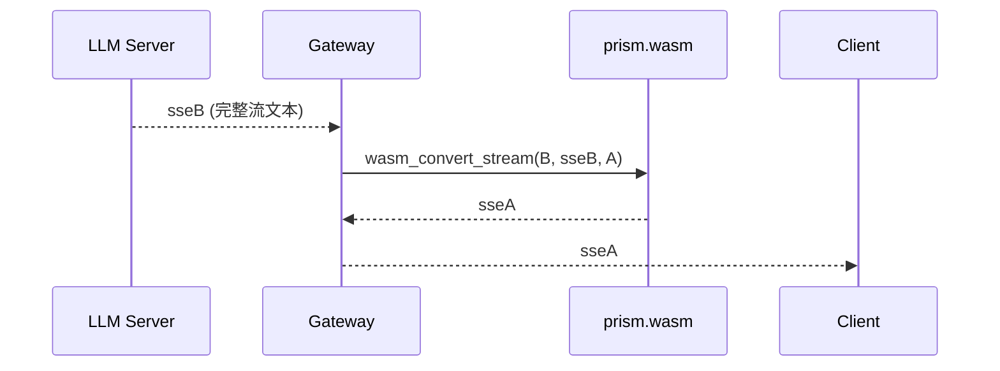
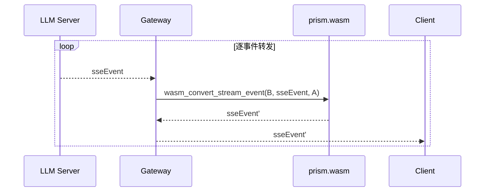

# Prism WASM Integration Guide

Prism is an LLM protocol conversion engine. It converts between provider formats (OpenAI, Anthropic, Gemini, Azure, Vertex, vLLM) via a neutral intermediate representation called **Lucent IR**. The WASM build exposes **23 exports** — 15 core conversion functions are pure `String → String` (no state, no side effects), plus query / scratch / logging / trace helpers — making it safe and easy to embed in any language with WASM support.

This guide is organized as **patterns and flows**, not per-language code. The repository ships production-grade reference wrappers for Go and TypeScript (`wrappers/`) — study those when you need a concrete implementation; the sections below tell you *what* to build and *why*.

## 核心概念

### 1. 纯函数模型

prism.wasm 是一个**纯函数库**：`格式 A 字符串 → 格式 B 字符串`。它不发请求、不管理连接、不处理网络。所有输入输出都通过字符串（linear memory 中的 UTF-16LE）传递。

> **推论**：所有转换函数无状态、可重入、可并行调用。不需要锁、不需要单例、不需要初始化连接池。每个调用独立完成。

### 2. 双向转换

每个转换函数都有明确的输入/输出方向：

| 方向 | 说明 |
|---|---|
| request | 客户端 → LLM 服务端的请求体 |
| response | LLM 服务端 → 客户端的响应体 |
| SSE stream | 流式响应（多事件） |
| SSE event | 流式响应（单事件，无状态高频转换） |

### 3. 信封契约（Envelope）

除 `wasm_list_providers` 外，所有函数返回**信封**，统一携带转换保真度信息：

```json
{"value": "...", "diagnostics": [{"field": "...", "status": "exact|degraded|unsupported|invalid", "detail": "..."}]}
```

- `value` — 转换结果（JSON 字符串或对象）
- `diagnostics` — 逐字段的转换保真度记录：`exact`（精确）/ `degraded`（降级）/ `unsupported`（不支持）/ `invalid`（非法）

错误信封：

```json
{"error": "message", "diagnostics": []}
```

> **最佳实践**：永远先检查 `error` 键，再访问 `value`。不要假设解析一定成功。

### 4. Provider 注册表

支持的协议由注册表驱动，运行时可枚举：

- 主名称：`openai`（Responses）、`openai-chat`、`anthropic`、`gemini`、`google-vertex`、`azure-openai`、`openai-codex`、`openai-vllm`
- 每个主名称有多个别名（如 `chat`、`claude`、`vllm` 等），source/target 参数传主名称或别名均可
- `wasm_list_providers` 返回全部主名称的 JSON 数组

## 架构模式（选型思路）

根据你的网关形态，选择以下模式之一：

### 模式 A：协议代理（Transit）— 最常用

**适用**：你的应用面向固定协议的客户端（如 OpenAI 格式），但后端可能切换不同供应商。

```
Client (格式 A) ──reqA──▶ Gateway ──reqB──▶ LLM Server (格式 B)
                        ▲  prism.wasm  ▲
                        └── 转换 ──────┘
```

- 请求：`wasm_convert_req(A, json, B)` → 转发 reqB
- 响应：`wasm_convert_resp(B, json, A)` → 回传 respA

**最佳实践**：在 Gateway 中**只**内嵌 prism.wasm 做格式转换，路由、限流、鉴权、连接管理全在 Gateway 自身。prism 不感知网络层。

### 模式 B：流式代理（SSE）

**方式 1 — 完整流转换**（小流或已缓冲的流）：



**方式 2 — 单事件转换**（推荐，高频实时流）：



**选型对比**：

| 维度 | `wasm_convert_stream` | `wasm_convert_stream_event` |
|---|---|---|
| 输入 | 完整 SSE 流文本 | 单个 SSE 事件 |
| 状态 | 有状态（块索引/工具参数跨帧拼接） | 无状态 |
| 复杂度 | O(n) 一次调用 | O(n) 逐事件，避免 O(n²) 累积 |
| 适用 | 已缓冲的小流、批处理 | 实时逐帧转发（推荐） |
| `[DONE]` | 输出目标协议流结束事件 | 同样支持 |

> **最佳实践**：实时流代理优先用 `wasm_convert_stream_event`。它无状态、可逐事件调用、延迟低。完整流转换仅用于已完整缓冲的场景。

### 模式 C：SDK 编解码 — 单供应商直连

**适用**：应用只与一个供应商交互，不需要协议互转。

```
App ──wasm_sdk_encode_req──▶ {"model":..., "messages":[...]}  → 发送给 API
App ◀──wasm_sdk_decode_resp── "Hi there!"
```

- `wasm_sdk_encode_req(provider, text)` — 纯文本 → 请求 JSON
- `wasm_sdk_decode_resp(provider, json)` — 响应 JSON → 纯文本
- `wasm_sdk_encode_stream` / `wasm_sdk_decode_sse` — 流式对应
- `wasm_sdk_capability(provider)` — 查询供应商能力声明

**选型决策树**：
1. 只用一个供应商？→ **模式 C**（SDK 编解码，最简）
2. 客户端协议固定、后端可切换？→ **模式 A**（Transit）
3. 需要流式？→ **模式 B**，实时用单事件转换

## 集成流程（语言无关）

无论用什么语言，集成 prism.wasm 都遵循同一条流程。下面按步骤展开，每步给出**思路**与**必须满足的约束**。

### 流程总览

```
1. 构建 prism.wasm
2. 实例化 WASM 模块（含 WASI + _start）
3. 实现 String ABI（UTF-16LE 读写）
4. 封装调用层（写参数 → 调导出 → 读结果）
5. 解析信封（先查 error，再取 value）
6. 处理大字符串（scratch 或宿主内存增长）
```

### Step 1 — 构建

```bash
moon build --target wasm
# 产物: _build/wasm/release/build/cmd/main/main.wasm
```

`cmd/main` 包通过 `moon.pkg` 的 `options(link: { "wasm": { "exports": [...], "export-memory-name": "memory" } })` 声明全部导出。构建产物可直接嵌入宿主程序（`//go:embed`、`include_bytes!`、`readFileSync` 等）。

> **最佳实践**：把 prism.wasm 作为构建产物嵌入二进制/应用包，避免运行时从文件系统加载（部署更简单、路径无歧义）。

### Step 2 — 实例化

MoonBit 的 `wasm` 目标依赖 WASI（stdout/stderr）。实例化时必须：

1. 提供 WASI 上下文（各运行时：wasmtime / wazero / wasmer / Node `WebAssembly` 均可，无 WASI 时至少屏蔽 stdout/stderr）
2. 调用 `_start` 导出初始化 MoonBit 运行时（**一次**，在首次调用转换函数之前）
3. 读取导出 `memory` 引用

> **最佳实践**：`_start` 只调用一次；不要在每个转换调用前重复调用。

### Step 3 — String ABI（核心）

Prism 的字符串以 **UTF-16LE** 存放在 linear memory，布局固定：

```
ptr - 4:  u32 length（UTF-16 码元数，LE）
ptr:      UTF-16LE 载荷（length × 2 字节）
```

- **写参数**：把字符串编码为 UTF-16LE → 在 `ptr - 4` 写码元数 → 在 `ptr` 写载荷 → 把 `ptr`（i32）作为函数参数
- **读结果**：从 `resultPtr - 4` 读 u32 长度 → 从 `resultPtr` 读 `length × 2` 字节 → 按 UTF-16LE 解码

> **关键约束**：
> - **长度是码元数，不是字节数**。BMP 字符 1 码元；增补字符（emoji、CJK 扩展 B+）占 2 码元。
> - 多数语言内部是 UTF-8，必须**转码**到 UTF-16LE；JS/TS 原生 UTF-16 免转码。
> - **不要**把参数写到 `0x1000` 以上——那是 MoonBit GC 堆区域。参数区用 `0x0400` 起、每参数间隔 ≥512 字节。

### Step 4 — 调用层

通用调用模式（所有语言一致）：

```
1. 复位 scratch 指针到 0x0400
2. 对每个字符串参数: writeString(ptr) → 记录 ptr → ptr += 512
3. 调用导出函数（传 i32 指针数组）
4. 从返回值 ptr 读结果字符串
```

> **最佳实践**：把「写参数 → 调导出 → 读结果」封装成一个 `call(func, args...)` 帮助函数，所有转换方法都走它。这样 ABI 细节只出现一次，其余代码专注业务。

### Step 5 — 信封解析

统一解析流程：

```
1. 检查原始字符串是否以 {"error": 开头 → 抛错/返回错误
2. JSON.parse 得到 {value, diagnostics}
3. value 交给业务；diagnostics 按 status 分类处理（exact 忽略 / degraded 记日志 / unsupported 警告 / invalid 报错）
```

> **最佳实践**：diagnostics 是**转换保真度**信号，不是错误。`degraded`/`unsupported` 表示字段被降级或丢弃——在高保真场景（如工具调用、多模态）应当检查并告警，而不是默默忽略。

### Step 6 — 大字符串

JSON payload（Anthropic 工具调用、图片 base64、超长 system prompt）常超过固定 scratch 区（~252 码元/参数）。两种方案：

**方案 1（推荐，prism ≥0.1.2）— WASM 侧 scratch 缓冲**：

- `wasm_init_scratch(size) → i32`：在 MoonBit 堆分配固定地址缓冲（一次性，建议 24576 = 8192 × 3）
- `wasm_read_scratch_arg(buf_ptr, offset) → String`：宿主把大字符串写入 `buf_ptr + offset`（带长度头），再让 prism 读成 String
- MoonBit 用引用计数（非移动 GC），地址**永久有效**——初始化一次即可

**方案 2 — 宿主内存增长**：小字符串用固定 scratch；大字符串在宿主侧增长 linear memory、写到新增长区末尾（`+4` 保证长度头不越界）。见 `wrappers/` 参考实现。

> **最佳实践**：先探测字符串大小——小字符串走固定 scratch（快），超限走大字符串路径。避免盲目放大 stride 浪费内存。

## 导出函数参考（23 个）

转换函数均 `String → String`，按名字从 WASM exports 调用。

### 低层 IR 转换（6）

| Export | Args | 说明 |
|---|---|---|
| `wasm_to_lux_req` | `(provider, json)` | Provider 请求 JSON → LucentRequest JSON |
| `wasm_lux_req_to_provider` | `(provider, luxJson)` | LucentRequest JSON → Provider 请求 JSON |
| `wasm_to_lux_resp` | `(provider, json)` | Provider 响应 JSON → LucentResponse JSON |
| `wasm_lux_resp_to_provider` | `(provider, luxJson)` | LucentResponse JSON → Provider 响应 JSON |
| `wasm_sse_to_events` | `(provider, sseText)` | Provider SSE → StreamEvent JSON 数组 |
| `wasm_events_to_sse` | `(provider, eventsJson)` | StreamEvent JSON 数组 → Provider SSE |

### 高层 SDK（5）

| Export | Args | 说明 |
|---|---|---|
| `wasm_sdk_encode_req` | `(provider, text)` | 纯文本 → Provider 请求 JSON |
| `wasm_sdk_decode_resp` | `(provider, json)` | Provider 响应 JSON → 纯文本 |
| `wasm_sdk_encode_stream` | `(provider, text)` | 纯文本 → 流式请求 JSON |
| `wasm_sdk_decode_sse` | `(provider, sseText)` | Provider SSE → PrismEvent JSON 数组 |
| `wasm_sdk_capability` | `(provider)` | 查询供应商能力声明 |

### 中转转换（4）

| Export | Args | 说明 |
|---|---|---|
| `wasm_convert_req` | `(source, json, target)` | 请求转换：source → target |
| `wasm_convert_resp` | `(source, json, target)` | 响应转换：source → target |
| `wasm_convert_stream` | `(source, sseText, target)` | SSE 流转换：source → target |
| `wasm_convert_stream_event` | `(source, sseEvent, target)` | 单 SSE 事件转换：source → target |

### 查询（1）

| Export | Args | 说明 |
|---|---|---|
| `wasm_list_providers` | `()` | 全部已注册 provider 主名称的 JSON 数组（唯一无字符串参数的导出，直接调用） |

### 大字符串 scratch（2）

| Export | Args | 说明 |
|---|---|---|
| `wasm_init_scratch` | `(size)` | 在 MoonBit 堆分配 scratch 缓冲，返回 i32 地址（一次性） |
| `wasm_read_scratch_arg` | `(buf_ptr, offset)` | 从 scratch 缓冲 offset 处读 String |

### 日志（2）

| Export | Args | 说明 |
|---|---|---|
| `wasm_log_init` | `(size)` | 分配日志缓冲（size + 4 头字节），返回 i32 地址 |
| `wasm_log_pos` | `(buf_ptr)` | 读取当前日志写入位置；宿主比较位置变化判断是否有新日志 |

### 追踪（3）

| Export | Args | 说明 |
|---|---|---|
| `wasm_convert_req_trace` | `(source, json, target, log_ptr, log_size)` | 请求转换 + 写追踪日志 |
| `wasm_convert_resp_trace` | `(source, json, target, log_ptr, log_size)` | 响应转换 + 写追踪日志 |
| `wasm_convert_stream_trace` | `(source, sseText, target, log_ptr, log_size)` | SSE 流转换 + 写追踪日志 |

> **最佳实践**：调试转换问题时用 `*_trace` 变体（比普通版本多写日志，位置变化可轮询）；生产环境用普通版本（更小开销）。

## 常见陷阱

1. **UTF-8 vs UTF-16**：第一大坑。Prism 内存中存 UTF-16LE，不是 UTF-8。多数语言（Rust/Go/Python）内部 UTF-8，必须转码。
2. **长度是码元数不是字节数**：`ptr - 4` 处的头字段计 UTF-16 码元（每码元 2 字节）。BMP 字符 1 码元 = 1 字符；增补字符（>U+FFFF）1 字符 = 2 码元。
3. **scratch 与 GC 堆冲突**：参数**不要**写在 `0x1000` 以上（MoonBit GC 堆区域）；每次调用复位 scratch 指针。大字符串（>252 码元）走 scratch API 或宿主内存增长（见 Step 6）。
4. **内存 buffer 分离**（JS/TS）：`WebAssembly.Memory.buffer` 在内存增长时会 detach。**每次调用**重新取 `DataView`/`Uint8Array`，不要加载时缓存。scratch API 的地址在内存增长后仍有效（引用计数 GC，非移动）。
5. **_start 必须执行**：模块有 `_start` 导出初始化 MoonBit 运行时，实例化后调用一次，再调任何转换函数。
6. **错误信封优先**：结果可能不是合法 JSON（错误时）。先检查 `{"error":` 前缀，再解析。
7. **`wasm_list_providers` 无参数**：唯一零字符串参数的导出，直接调用，无需写 linear memory。

## 参考实现

仓库提供生产级 wrapper，可直接使用或作为实现模板：

- **Go wrapper**（`wrappers/go/`）：基于 wazero（纯 Go、无 CGo）。`go get github.com/morning-start/prism/wrappers/go`
- **TypeScript wrapper**（`wrappers/ts/`）：基于 WebAssembly API。`npm install @morning-start/prism-wasm`

按本文档 Step 1–6 实现新语言 wrapper 时，参考它们的结构分层：

1. **运行时层** — 加载 WASM、实现 UTF-16 ABI 读写
2. **客户端层** — 每个导出映射一个类型化方法，解析信封
3. **类型层** — 原生定义 Envelope、Diagnostic、PrismEvent 类型

## 使用示例（流程示范）

### 单事件流转换

```
输入:  data: {"id":"1","object":"chat.completion.chunk","choices":[{"index":0,"delta":{"content":"Hello"}}]}
调用:  wasm_convert_stream_event("openai-chat", event, "anthropic")
输出:  对应 Anthropic 格式的 SSE 事件（content_block_delta）
```

`[DONE]` 标记同样支持：

```
输入:  data: [DONE]
调用:  wasm_convert_stream_event("openai-chat", done_event, "anthropic")
输出:  Anthropic 的流结束事件（message_stop）
```

### 错误处理流程

```
输入:  无效 SSE 文本
调用:  wasm_convert_stream_event("openai-chat", "invalid sse data", "anthropic")
输出:  错误信封 {"error": "...", "diagnostics": []}
```

**处理流程**：先查 error 键 → 有则按错误处理（重试/降级/告警）；无则取 value 并检查 diagnostics 保真度。


