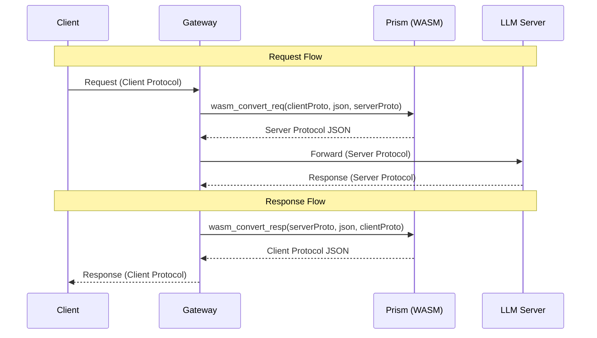
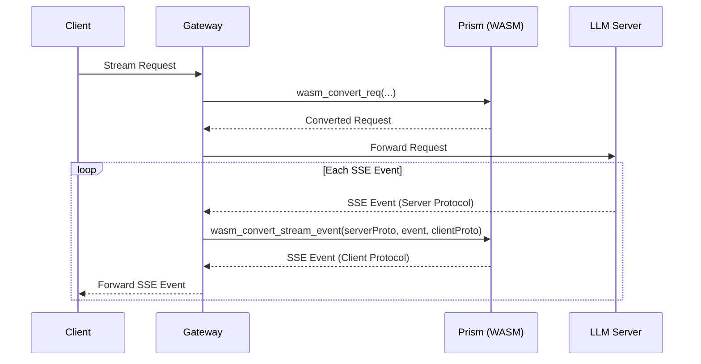
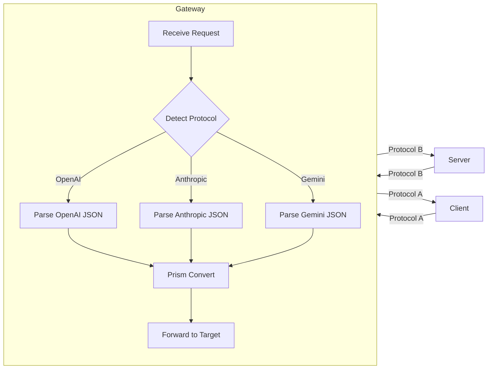

# Prism WASM Direct Usage

Call prism.wasm exported functions directly from any host language.

## Architecture: Relay Gateway Pattern

Prism sits in the middle as a protocol conversion relay. The gateway wraps Prism and forwards traffic between client and server.



### Streaming Flow



### Gateway Data Flow



## How It Works

All Prism WASM functions accept and return **strings**. Strings pass through linear memory using UTF-16LE encoding with a 4-byte length header.

```
Host ──[write UTF-16LE to linear memory]──► WASM function ──[returns JSON string]──► Host
```

## String ABI

Every string in/out follows this layout in WASM linear memory:

```
┌──────────────┬─────────────────────┐
│ Length (4B)   │ UTF-16LE Data       │
│ u32 LE       │ (byte_len bytes)    │
└──────────────┴─────────────────────┘
  ptr - 4        ptr
```

- **Length**: byte count (NOT character count), u32 little-endian at `ptr - 4`
- **Data**: UTF-16LE encoded characters starting at `ptr`

### Writing a String (Host → WASM)

```javascript
function writeString(memory, ptr, str) {
  const len = str.length * 2; // byte length
  new DataView(memory.buffer).setUint32(ptr - 4, len, true);
  const view = new Uint16Array(memory.buffer, ptr, str.length);
  for (let i = 0; i < str.length; i++) view[i] = str.charCodeAt(i);
}
```

### Reading a String (WASM → Host)

```javascript
function readString(memory, ptr) {
  const len = new DataView(memory.buffer).getUint32(ptr - 4, true);
  const view = new Uint16Array(memory.buffer, ptr, len / 2);
  return String.fromCharCode(...view);
}
```

## Quick Start (JavaScript)

```javascript
const fs = require('fs');

// 1. Load WASM
const wasmBytes = fs.readFileSync('prism.wasm');
const { instance } = await WebAssembly.instantiate(wasmBytes);
const { memory } = instance.exports;

// 2. Allocate scratch buffer for passing strings
const bufPtr = instance.exports.wasm_init_scratch(24576); // 8192 × 3

// 3. Write arguments
writeString(memory, bufPtr, 'openai');                    // arg 0
writeString(memory, bufPtr + 8192, '{"model":"gpt-4o"}'); // arg 1
writeString(memory, bufPtr + 16384, 'anthropic');         // arg 2

// 4. Read arguments in WASM and call function
const provider = instance.exports.wasm_read_scratch_arg(bufPtr, 0);
const jsonStr = instance.exports.wasm_read_scratch_arg(bufPtr, 8192);
const target = instance.exports.wasm_read_scratch_arg(bufPtr, 16384);

// 5. Call exported function (returns pointer to result string)
const resultPtr = instance.exports.wasm_convert_req(provider, jsonStr, target);
const result = readString(memory, resultPtr);
console.log(result);
```

## Gateway Implementation

### Request Handler

```javascript
async function handleRequest(clientReq, clientProtocol, serverProtocol) {
  const bufPtr = instance.exports.wasm_init_scratch(24576);
  const { memory } = instance.exports;

  // Convert request: client protocol → server protocol
  writeString(memory, bufPtr, clientProtocol);
  writeString(memory, bufPtr + 8192, clientReq);
  writeString(memory, bufPtr + 16384, serverProtocol);

  const src = instance.exports.wasm_read_scratch_arg(bufPtr, 0);
  const json = instance.exports.wasm_read_scratch_arg(bufPtr, 8192);
  const tgt = instance.exports.wasm_read_scratch_arg(bufPtr, 16384);

  const resultPtr = instance.exports.wasm_convert_req(src, json, tgt);
  return parseResult(readString(memory, resultPtr));
}
```

### Response Handler

```javascript
async function handleResponse(serverResp, serverProtocol, clientProtocol) {
  const bufPtr = instance.exports.wasm_init_scratch(24576);
  const { memory } = instance.exports;

  writeString(memory, bufPtr, serverProtocol);
  writeString(memory, bufPtr + 8192, serverResp);
  writeString(memory, bufPtr + 16384, clientProtocol);

  const src = instance.exports.wasm_read_scratch_arg(bufPtr, 0);
  const json = instance.exports.wasm_read_scratch_arg(bufPtr, 8192);
  const tgt = instance.exports.wasm_read_scratch_arg(bufPtr, 16384);

  const resultPtr = instance.exports.wasm_convert_resp(src, json, tgt);
  return parseResult(readString(memory, resultPtr));
}
```

### Stream Event Handler

```javascript
async function handleStreamEvent(sseEvent, serverProtocol, clientProtocol) {
  const bufPtr = instance.exports.wasm_init_scratch(24576);
  const { memory } = instance.exports;

  writeString(memory, bufPtr, serverProtocol);
  writeString(memory, bufPtr + 8192, sseEvent);
  writeString(memory, bufPtr + 16384, clientProtocol);

  const src = instance.exports.wasm_read_scratch_arg(bufPtr, 0);
  const evt = instance.exports.wasm_read_scratch_arg(bufPtr, 8192);
  const tgt = instance.exports.wasm_read_scratch_arg(bufPtr, 16384);

  const resultPtr = instance.exports.wasm_convert_stream_event(src, evt, tgt);
  return parseResult(readString(memory, resultPtr));
}
```

## Exported Functions

### IR Conversion (6 functions)

| Function | Args | Returns |
|----------|------|---------|
| `wasm_to_lux_req(provider, json)` | Provider JSON → LucentRequest JSON |
| `wasm_lux_req_to_provider(provider, json)` | LucentRequest → Provider JSON |
| `wasm_to_lux_resp(provider, json)` | Provider JSON → LucentResponse JSON |
| `wasm_lux_resp_to_provider(provider, json)` | LucentResponse → Provider JSON |
| `wasm_sse_to_events(provider, sse)` | SSE text → StreamEvent JSON array |
| `wasm_events_to_sse(provider, json)` | StreamEvent array → SSE text |

### SDK APIs (5 functions)

| Function | Args | Returns |
|----------|------|---------|
| `wasm_sdk_encode_req(provider, text)` | Text → Provider request JSON |
| `wasm_sdk_decode_resp(provider, json)` | Provider response → Text |
| `wasm_sdk_encode_stream(provider, text)` | Text → Stream request JSON |
| `wasm_sdk_decode_sse(provider, sse)` | SSE → PrismEvent JSON array |
| `wasm_sdk_capability(provider)` | Provider capability JSON |

### Cross-Protocol Conversion (4 functions)

| Function | Args | Returns |
|----------|------|---------|
| `wasm_convert_req(source, json, target)` | Request: source → target |
| `wasm_convert_resp(source, json, target)` | Response: source → target |
| `wasm_convert_stream(source, sse, target)` | Stream: source → target |
| `wasm_convert_stream_event(source, event, target)` | Single event: source → target |

### Memory Management (2 functions)

| Function | Args | Returns |
|----------|------|---------|
| `wasm_init_scratch(size)` | Allocate scratch buffer → ptr |
| `wasm_read_scratch_arg(ptr, offset)` | Read string from scratch |

### Logging (4 functions)

| Function | Args | Returns |
|----------|------|---------|
| `wasm_log_init(size)` | Allocate log buffer → ptr |
| `wasm_log_pos(ptr)` | Current write position |
| `wasm_convert_req_trace(src, json, tgt, logPtr, logSz)` | Convert request with logging |
| `wasm_convert_resp_trace(src, json, tgt, logPtr, logSz)` | Convert response with logging |
| `wasm_convert_stream_trace(src, sse, tgt, logPtr, logSz)` | Convert stream with logging |

### Query (1 function)

| Function | Args | Returns |
|----------|------|---------|
| `wasm_list_providers()` | List all providers → JSON array |

## Scratch Buffer Pattern

```
1. wasm_init_scratch(24576)         → bufPtr
2. writeString(memory, bufPtr, s1)   → write arg 0
3. writeString(memory, bufPtr+8192, s2) → write arg 1
4. s1 = wasm_read_scratch_arg(bufPtr, 0)
5. s2 = wasm_read_scratch_arg(bufPtr, 8192)
6. result = wasm_convert_req(s1, json, s2)
```

**Recommended sizes**: 8192 bytes per argument, 24576 for 3 arguments.

## Log Buffer Pattern

```javascript
const logPtr = instance.exports.wasm_log_init(16384);
const result = instance.exports.wasm_convert_req_trace(
  source, json, target, logPtr, 16384
);
const logPos = instance.exports.wasm_log_pos(logPtr);
const logBytes = new Uint8Array(memory.buffer, logPtr + 4, logPos - 4);
const logs = new TextDecoder().decode(logBytes);
// Format: "[LEVEL] step: message\n"
```

## Result Envelope

```json
// Success
{"value": "...", "diagnostics": [...]}

// Error
{"error": "message", "diagnostics": []}
```

Check: `result.includes('"error"')`

## Supported Providers

`openai`, `openai-responses`, `openai-codex`, `openai-azure`, `openai-vllm`, `anthropic`, `gemini`, `gemini-vertex`, `gemini-interactions`

## Examples

- [JavaScript/Node.js](examples/javascript.md)
- [Python](examples/python.md)

## See Also

- [String ABI Details](references/string-abi.md)
- [All Function Signatures](references/exports.md)
