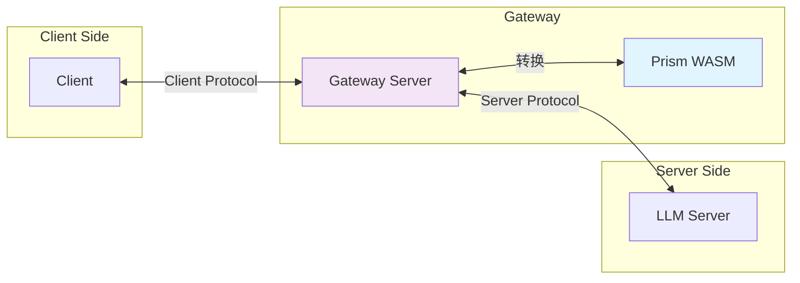
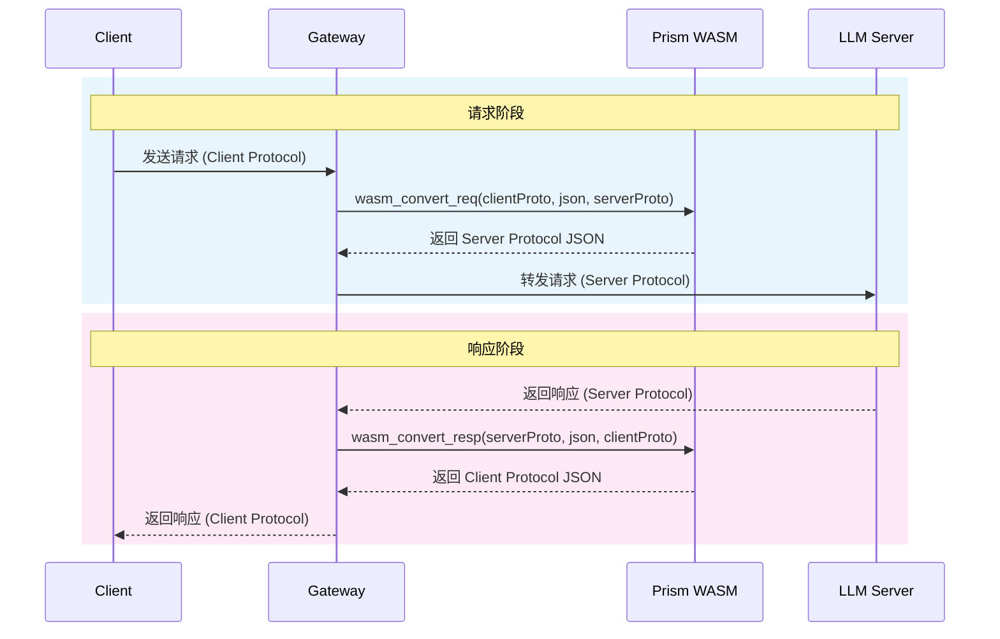
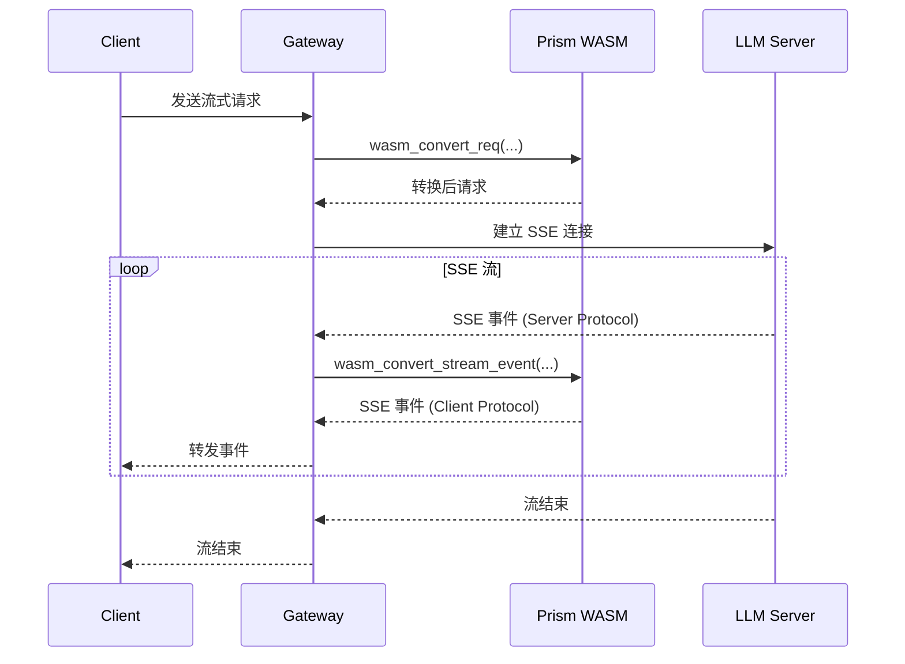
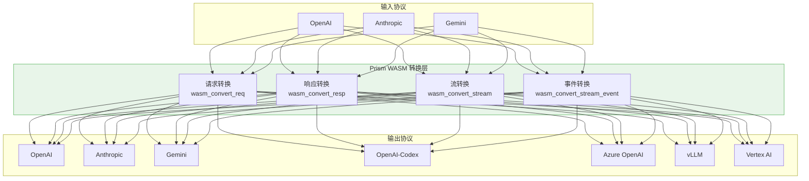

# Prism WASM 技能

本技能帮助你直接使用编译好的 `prism.wasm` 进行 LLM API 协议转换。**仅使用 WASM 原生调用，不使用任何包装器库**。

## 架构概览

### 核心中转站模式

Prism 作为协议转换的中转站，位于客户端和 LLM 服务器之间：



### 请求/响应流程



### 流式响应流程



### 完整架构图



## 快速开始

### 1. 加载 WASM

```javascript
// 加载 wasm 文件
const wasmBytes = await fetch('prism.wasm').then(r => r.arrayBuffer());

// 实例化（需要导入 memory）
const memory = new WebAssembly.Memory({ initial: 256, maximum: 65536 });
const { instance } = await WebAssembly.instantiate(wasmBytes, {
  env: { memory }
});

// 导出函数
const exports = instance.exports;
```

### 2. 字符串读写（UTF-16LE ABI）

Prism 使用 UTF-16LE 编码的字符串，ABI 如下：

- **字符串指针**：指向 UTF-16LE 数据的起始位置
- **长度存储**：在 `ptr - 4` 的位置存储 4 字节的字符串长度（字节数 = 字符数 × 2）

```javascript
// 写入字符串到 WASM 内存
function writeString(str) {
  const bytes = new TextEncoder().encode(str);
  const len = bytes.length;
  // 分配内存（4 字节长度头 + 数据）
  const ptr = exports.wasm_init_scratch(len + 4);
  // 写入长度
  new DataView(memory.buffer).setUint32(ptr - 4, len, true);
  // 写入数据
  new Uint8Array(memory.buffer, ptr, len).set(bytes);
  return { ptr, len };
}

// 从 WASM 内存读取字符串
function readString(ptr) {
  const len = new DataView(memory.buffer).getUint32(ptr - 4, true);
  const bytes = new Uint8Array(memory.buffer, ptr, len);
  return new TextDecoder().decode(bytes);
}
```

### 3. 协议转换

```javascript
// 转换请求
function convertRequest(clientProto, request, serverProto) {
  const reqJson = JSON.stringify(request);
  const resultPtr = exports.wasm_convert_req(
    clientProto, reqJson, serverProto
  );
  const result = readString(resultPtr);
  return JSON.parse(result);
}

// 转换响应
function convertResponse(serverProto, response, clientProto) {
  const respJson = JSON.stringify(response);
  const resultPtr = exports.wasm_convert_resp(
    serverProto, respJson, clientProto
  );
  const result = readString(resultPtr);
  return JSON.parse(result);
}

// 转换单个 SSE 事件
function convertStreamEvent(serverProto, event, clientProto) {
  const eventJson = JSON.stringify(event);
  const resultPtr = exports.wasm_convert_stream_event(
    serverProto, eventJson, clientProto
  );
  const result = readString(resultPtr);
  return JSON.parse(result);
}
```

### 4. 完整 Gateway 示例

```javascript
class PrismGateway {
  constructor(exports, memory) {
    this.exports = exports;
    this.memory = memory;
  }

  // 内部方法：写入字符串
  _writeString(str) {
    const bytes = new TextEncoder().encode(str);
    const len = bytes.length;
    const ptr = this.exports.wasm_init_scratch(len + 4);
    new DataView(this.memory.buffer).setUint32(ptr - 4, len, true);
    new Uint8Array(this.memory.buffer, ptr, len).set(bytes);
    return { ptr, len };
  }

  // 内部方法：读取字符串
  _readString(ptr) {
    const len = new DataView(this.memory.buffer).getUint32(ptr - 4, true);
    const bytes = new Uint8Array(this.memory.buffer, ptr, len);
    return new TextDecoder().decode(bytes);
  }

  // 转换请求
  convertRequest(clientProto, request, serverProto) {
    const reqJson = JSON.stringify(request);
    const resultPtr = this.exports.wasm_convert_req(
      clientProto, reqJson, serverProto
    );
    return JSON.parse(this._readString(resultPtr));
  }

  // 转换响应
  convertResponse(serverProto, response, clientProto) {
    const respJson = JSON.stringify(response);
    const resultPtr = this.exports.wasm_convert_resp(
      serverProto, respJson, clientProto
    );
    return JSON.parse(this._readString(resultPtr));
  }

  // 转换流式事件
  convertStreamEvent(serverProto, event, clientProto) {
    const eventJson = JSON.stringify(event);
    const resultPtr = this.exports.wasm_convert_stream_event(
      serverProto, eventJson, clientProto
    );
    return JSON.parse(this._readString(resultPtr));
  }

  // 转换完整流
  convertStream(serverProto, events, clientProto) {
    const eventsJson = JSON.stringify(events);
    const resultPtr = this.exports.wasm_convert_stream(
      serverProto, eventsJson, clientProto
    );
    return JSON.parse(this._readString(resultPtr));
  }

  // 列出支持的 Provider
  listProviders() {
    const resultPtr = this.exports.wasm_list_providers();
    return JSON.parse(this._readString(resultPtr));
  }
}
```

## 支持的 Provider 列表

| Provider | ID | 说明 |
|----------|------|------|
| OpenAI | `openai` | 标准 OpenAI API |
| Anthropic | `anthropic` | Claude API |
| Gemini | `gemini` | Google Gemini API |
| OpenAI Responses | `openai-responses` | OpenAI Responses API |
| OpenAI Codex | `openai-codex` | OpenAI Codex API |
| Azure OpenAI | `openai-azure` | Azure 部署的 OpenAI |
| vLLM | `openai-vllm` | vLLM 本地部署 |
| Vertex AI | `gemini-vertex` | Google Cloud Vertex AI |
| Gemini Interactions | `gemini-interactions` | Gemini Interactions API |

## WASM 导出函数参考

### 核心转换函数

| 函数 | 说明 |
|------|------|
| `wasm_convert_req(client, req, server)` | 转换请求 |
| `wasm_convert_resp(server, resp, client)` | 转换响应 |
| `wasm_convert_stream(server, events, client)` | 转换完整流 |
| `wasm_convert_stream_event(server, event, client)` | 转换单个 SSE 事件 |
| `wasm_convert_req_trace(client, req, server)` | 带 trace 的请求转换 |

### 工具函数

| 函数 | 说明 |
|------|------|
| `wasm_init_scratch(size)` | 初始化 scratch 缓冲区 |
| `wasm_read_scratch_arg()` | 读取 scratch 参数 |
| `wasm_list_providers()` | 列出所有支持的 provider |
| `wasm_log_init()` | 初始化日志缓冲区 |
| `wasm_log_pos()` | 获取日志位置 |
| `wasm_log_flush()` | 刷新日志 |
| `wasm_panic(ptr)` | 处理 panic |

## 最佳实践

1. **单例模式**：一个 WASM 实例足够处理多个并发请求
2. **错误处理**：所有转换函数返回 `Result<T, E>`，需要检查返回值
3. **内存管理**：`wasm_init_scratch` 会自动管理内存，无需手动释放
4. **流式处理**：使用 `wasm_convert_stream_event` 逐个事件转换，避免一次性加载整个流

## 相关文档

- [WASM 导出参考](references/exports.md) - 所有导出函数的详细说明
- [字符串 ABI 规范](references/string-abi.md) - UTF-16LE 字符串编码规范
- [JavaScript 示例](examples/javascript.md) - JavaScript 完整集成示例
- [Python 示例](examples/python.md) - Python 完整集成示例
